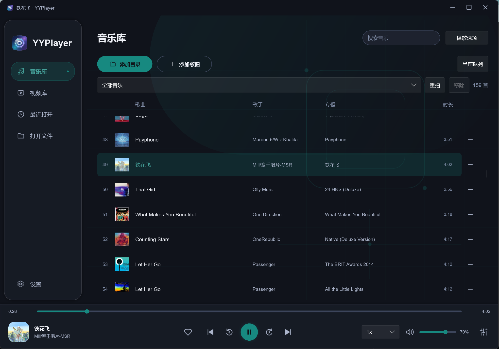
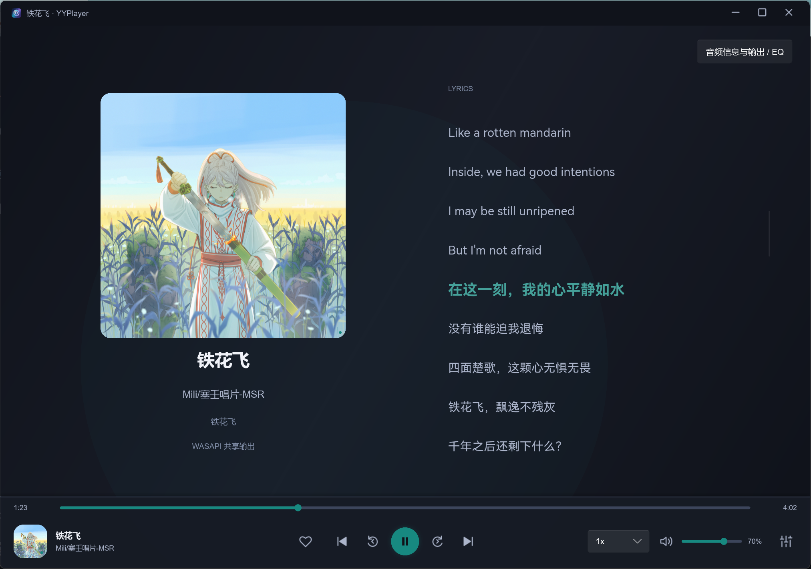
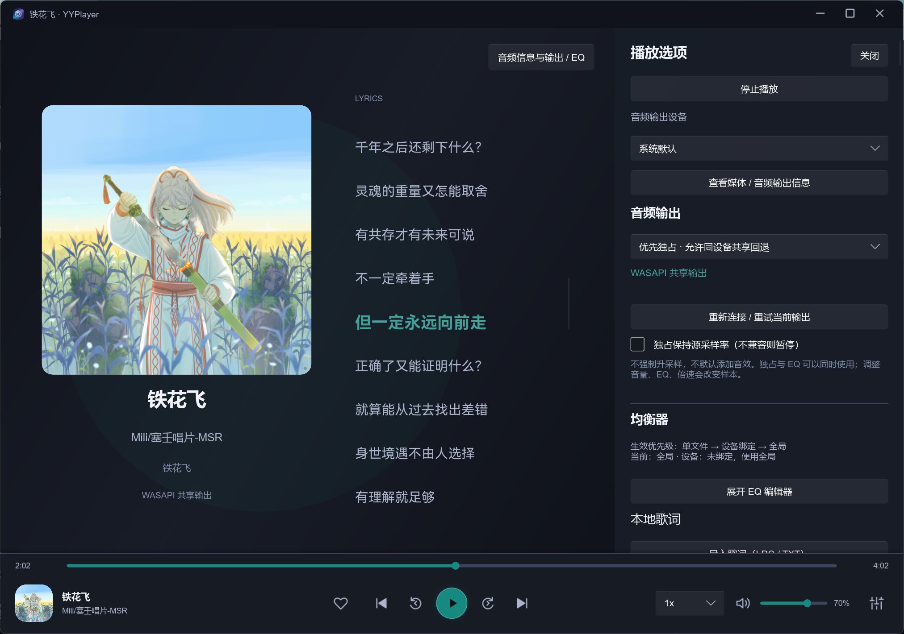
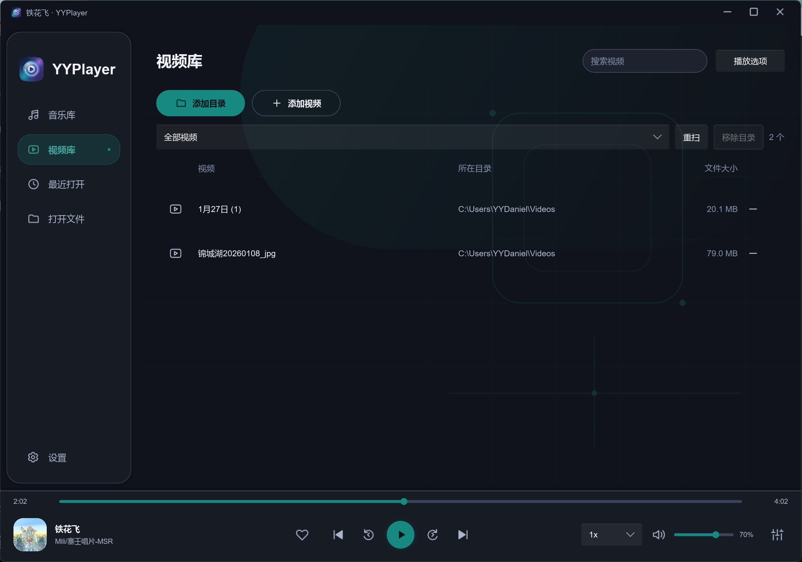
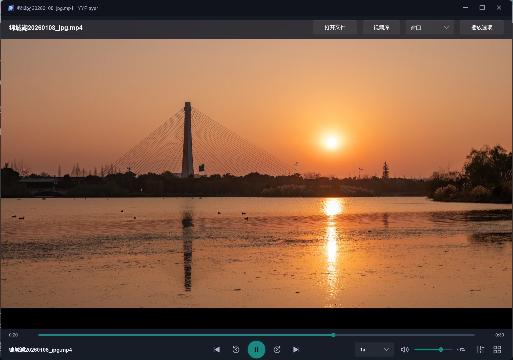
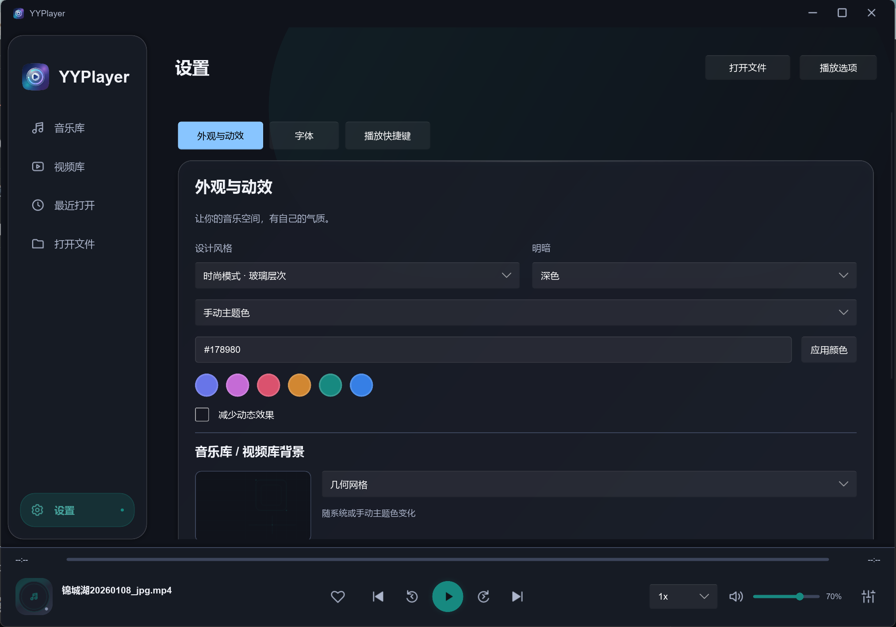

#  YYPlayer


使用 Rust、Slint 和 libmpv 构建的本地音视频播放器。Windows x64 / Ubuntu 26.04 amd64 共用同一份源码，通过条件编译选择平台实现；实际验收与限制见 [STATUS](docs/STATUS.md)。

## 功能

- 音视频播放：队列、进度、倍速、音量、音轨与字幕选择；视频支持逐帧、截图、章节和 A–B 循环。
- 音频输出：设备选择，Windows WASAPI 与 Linux PipeWire / PulseAudio / ALSA 输出，共享 / 优先独占 / 严格独占策略与实际状态；默认不强制升采样，不启用额外音效。
- 均衡器：手动调节、预设导入 / 导出，支持全局、设备和单文件设置，音视频共用。
- 音乐库：添加歌曲或递归扫描目录，搜索、筛选、重扫，显示标签和封面；移除记录不删除原文件。
- 歌曲大页面：点击左下封面展开，点击封面返回音乐库；自动加载同名 LRC 或内嵌歌词，也可手动导入 LRC / TXT。
- 视频库：添加目录或单个视频，搜索、筛选、重扫与移除；点击后进入播放器，返回库保留本次观看位置。
- 视频界面：按需初始化 libmpv 视频渲染器；窗口、最大化与全屏，控件自动隐藏；可配置快捷键，方向键默认调音量、短按跳转 5 秒、长按临时 3 倍速。
- 播放设置：查看媒体与实际解码器信息，按全局、文件夹或单文件设置解码方式。
- 界面定制：简洁 / 时尚主题、浅色 / 深色与主题色，可跟随 Windows 系统偏好或 Linux desktop portal；音乐 / 视频库及歌词页各有 4 款主题色背景，也可分别选本地图片并调透明度、模糊；支持减少动效，以及界面、歌词、字幕字体设置。

Linux 使用 PipeWire / PulseAudio 与 ALSA 直连路径，保留相同的媒体库、歌词、EQ、视频控件和主题设置；平台音频语义与打包说明见 [Linux 指南](docs/LINUX.md)。macOS 尚未验收；HDR 显示输出、位准确输出、ASIO / DSD 和无缝播放仍待完善。独占输出不等于位准确输出。

## 系统版本与包兼容性

以下为 2026-10-03 根据代码、锁定依赖、运行时 API 和现有二进制推测的最低条件；推测不等于旧系统已经通过验收。架构限定 Windows x64 / Linux amd64。

| 平台 | 推测最低版本 / 条件 | 实际验证状态 |
| --- | --- | --- |
| Windows 核心功能 | **Windows 10 1607（Build 14393）**；Rust MSVC 的下限是 Windows 10，mpv 0.41 的下限是 1607。固定 DLL 的完整导入与显卡驱动仍可能提高实际门槛 | 已有 Windows 11 x64 验收；Windows 10 未验证 |
| Windows 原生圆角 | **Windows 11 21H2（Build 22000）**；`DWMWA_WINDOW_CORNER_PREFERENCE` 从此版本提供。代码将它作为可选提示，失败不会阻止核心播放 | 已有 Windows 11 验收；Windows 10 不提供这项原生效果 |
| Ubuntu 现有 deb / AppImage | **Ubuntu 26.04 LTS**；当前主程序实际要求 `GLIBC_2.43`，deb 还要求 `libmpv2 >= 0.41.0` | Ubuntu 26.04.1 amd64 原生 Wayland 播放 / GPU 和独立 X11 UI 通过；干净系统安装待验 |
| Debian 现有 Linux 包 | **Debian 14 / forky（目前 testing）作为依赖满足的候选**；当前仓库提供 glibc 2.43 与 libmpv 0.41。Debian 13 的 glibc 2.41 / libmpv 0.40 不满足当前包要求 | Debian 未编译 / 真机验收；不承诺 testing 或未来正式版必然兼容 |

Windows 推测依据：[Rust MSVC 系统要求](https://doc.rust-lang.org/rustc/platform-support/windows-msvc.html)、[mpv 0.41 系统要求](https://github.com/mpv-player/mpv/blob/v0.41.0/README.md)、[Microsoft 圆角 API 要求](https://learn.microsoft.com/en-us/windows/win32/api/dwmapi/ne-dwmapi-dwm_window_corner_preference)。Debian 仓库依据：[trixie libc6](https://packages.debian.org/trixie/libc6) / [libmpv2](https://packages.debian.org/trixie/libmpv2)、[forky libc6](https://packages.debian.org/forky/libc6) / [libmpv2](https://packages.debian.org/forky/libmpv2)；版本以查询日期为准。

Rust crate 通常链接进程序，但这不等于整个应用完全静态链接。本项目的 Linux GNU 产物动态依赖 glibc、libm、fontconfig 等，libmpv 由 `libloading` 运行时加载；图形和音频库也有动态加载路径。当前 ELF 的 `acosf` / `atan2f` 实际引用 `GLIBC_2.43`，因此当前 AppImage 同样不能绕过这个宿主门槛。

deb 是 Debian 系包格式，仍受架构、包名、ABI、库版本与桌面驱动限制，不能通用于所有 Debian 系系统。[Arch 使用 pacman / `.pkg.tar.zst`](https://wiki.archlinux.org/title/Creating_packages)，不能用 pacman 原生安装 deb；可以另做 Arch 包，或在满足 glibc / GPU / 桌面服务条件后验证 AppImage，当前未验收 Arch。

较早的 Ubuntu / Debian 可能通过在较旧系统上重新编译应用及配套运行时获得支持，但不能直接使用本次包。源码本身没有一个与发行版年号一一对应的 API 下限；例如 Ubuntu 24.04 的系统 libmpv 为 0.37、Debian 13 为 0.40，若要保持本轮完整音频策略，需要另行提供并验证 libmpv >= 0.41 及其依赖。`mpv_get_time_ns` 已在 client API 2.2 引入，不能把仅有 `libmpv.so.2` 当成所有符号 / 日志协议均兼容。详情与核查命令见 [最低版本推测记录](docs/validation/platform-minimums.md)。

## 截图







## 编译

Windows 和 Linux 共用 Cargo workspace、Cargo.lock 与业务 / UI 代码，不需要切换到各自专用的源码分支。在相应系统准备构建依赖后，都使用：

```bash
cargo build --locked --release -p yyplayer-app --bin yyplayer
```

默认本机目标下，Windows MSVC 生成 `target/release/yyplayer.exe`，Linux GNU 生成 `target/release/yyplayer`；显式传入 `--target` 时产物位于对应的 target 子目录。编译成功后仍需各平台的 libmpv 运行时与系统库。

用户已确认：对 `dev-linux` 的共用代码运行 **Windows x64 packages** 工作流可以完成 Windows 编译打包。此次确认限编译与打包，实际播放 / 安装 / 设备回归见 [状态与证据](docs/STATUS.md)。

### Windows x64

需要 Windows x64、Rust MSVC 工具链、Visual Studio C++ Build Tools 和 Windows SDK。已验证 Rust / Cargo 1.97.0，Slint / slint-build 固定为 1.17.1。

在仓库根目录用 PowerShell 执行：

```powershell
# 获取固定版本 libmpv，并校验下载文件和 DLL
powershell -ExecutionPolicy Bypass -File scripts/Get-Mpv.ps1
cargo build --locked --release -p yyplayer-app --bin yyplayer
```

首次获取依赖需要联网。运行时脚本优先使用 7-Zip，未安装时尝试能解压 7z 的 Windows `tar.exe`；解压失败时见 [运行时说明](third_party/mpv/README.md)。

## 运行

```powershell
.\target\release\yyplayer.exe
# 也可以直接打开本地媒体
.\target\release\yyplayer.exe "D:\Videos\example.mp4"
```

开发时使用 `cargo run --locked -p yyplayer-app`。保留 `third_party/mpv/windows-x64` 中的固定运行时，应用会自动查找并校验 DLL。

启动后在音乐库添加目录或歌曲，也可拖入文件。输出设备、独占、EQ 和歌词导入位于“播放选项”；外观、字体与快捷键位于“设置”。Windows 配置保存在 `%APPDATA%\YYPlayer\settings.json`。

## Ubuntu 26.04

```bash
python3 scripts/check-linux-deps.py   # 汇总本机缺少的 apt 依赖
cargo build --locked --release -p yyplayer-app --bin yyplayer
./target/release/yyplayer
python3 scripts/package-linux.py --skip-build  # deb / AppImage / 对应源码与清单 → dist/
```

支持原生 Wayland / X11 构建，配置保存在 `${XDG_CONFIG_HOME:-$HOME/.config}/YYPlayer/settings.json`。deb 使用系统 libmpv；AppImage 携带经校验的内核和非驱动依赖，仍需要宿主图形驱动与桌面服务。完整安装、输出策略和验收命令见 [Linux 指南](docs/LINUX.md)。

## 手动测试 Linux 最低编译版本

GitHub Actions 的 **Linux compatibility compile matrix** 仅手动触发。默认逐一编译 Ubuntu **18.04 / 20.04 / 22.04 / 24.04 / 26.04** 和 Debian **9 / 10 / 11 / 12 / 13**，可选 Debian 14 testing；统一 Rust 1.99.0 和 Cargo.lock，完成 Release 编译后汇总 Ubuntu / Debian 各自的最早成功版本。

先将工作流和配套脚本提交到 GitHub 默认分支以注册手动入口，再在 **Actions → Linux compatibility compile matrix → Run workflow** 选择含有共用代码及该工作流的分支；合并后可直接选择 `master`，合并前可选择 `dev-linux`。运行完成后查看 Summary，或下载 `linux-compatibility-report-<attempt>` 内的 `report.md` / `report.json`；各系统另有完整日志。环境失败或超时会标为未决，编译通过不代表播放或安装兼容。具体参数、报告规则与限制见 [手动编译矩阵指南](docs/LINUX_COMPATIBILITY_CI.md)。当前尚未运行远端矩阵，最低编译版本仍待实测。

## 文档与许可

[更新日志](CHANGELOG.md) · [开发指南](CONTRIBUTING.md) · [完整规划](docs/DEVELOPMENT_PLAN.md) · [实际状态与验收](docs/STATUS.md) · [GitHub 发布说明](docs/PUBLISHING.md)

项目自身源码与原创 UI 资源采用 **GPL-3.0-only**，见 [LICENSE](LICENSE)。第三方组件保留各自许可，见 [THIRD_PARTY_NOTICES](THIRD_PARTY_NOTICES.md)。源码主分支为 `master`；本次 Windows/Linux 共用代码在 `dev-linux` 准备合入主分支。开发分支用于组织变更，不决定编译平台；开发包不代替发行与硬件资格验收。
