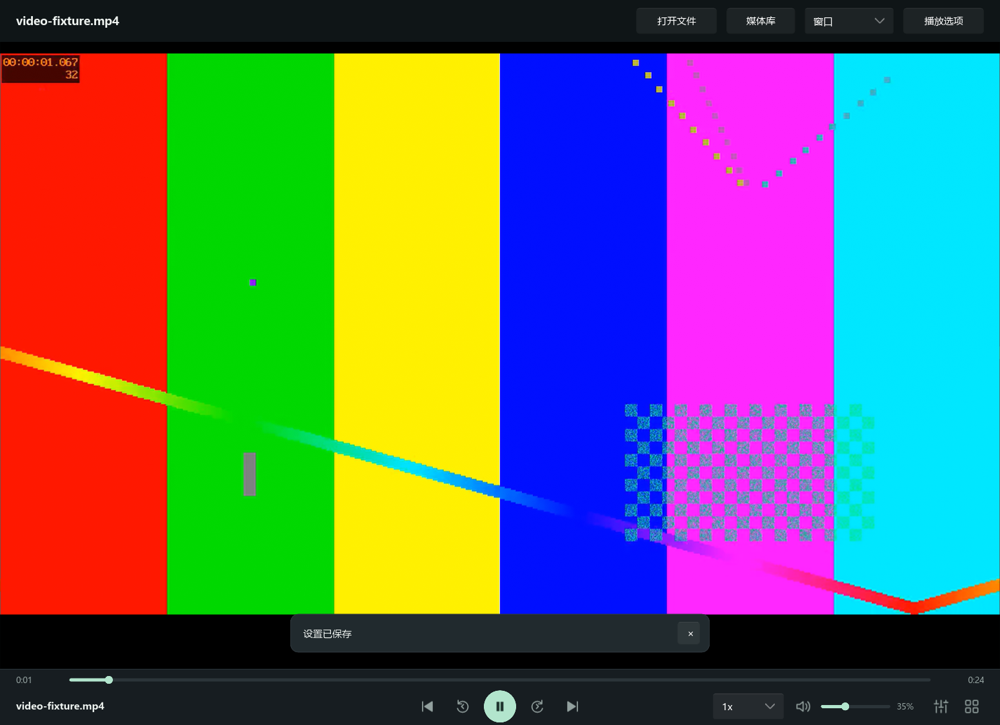
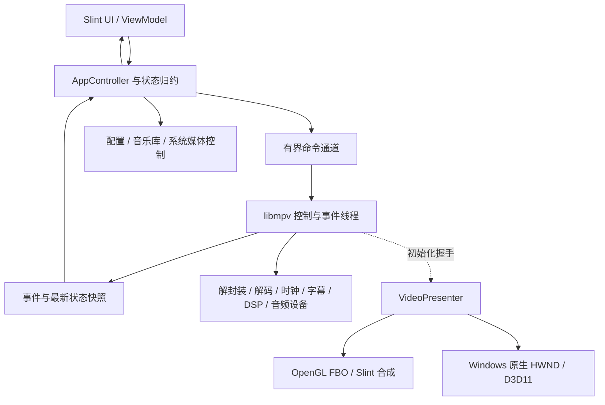

# YYPlayer：Rust + Slint 音视频播放器

> 更新日期：2026-10-01。已从界面框架升级为 **Windows 视频播放开发预览**：真实 libmpv 播放、GPU 合成、设备 / 轨道选择、可配置快捷键及分级解码设置已接入。仍不是正式发行包；独占 / EQ / HDR 输出及其他平台验收留待后续。开发规则见 [AGENTS](AGENTS.md)，实际进度与证据见 [STATUS](docs/STATUS.md)。

## 当前实现与快速启动

### 2026-10-01：视频页面布局精简目标

- 视频顶部工具栏改为覆盖画面的浮层，在窗口 / 最大化 / 全屏下均可自动隐藏；清除工具栏上方空白，悬停工具栏或打开选项时保持可用。
- 底部播放按钮按整个窗口居中，左侧放媒体标题，右侧放倍速 / 音量 / 选项，去掉重复的速度文字；音乐和视频继续共用 PlayerBar。
- 显示 / 隐藏顶部栏不改变视频渲染尺寸；扩展 ui-feedback 检查顶部超时与悬停，并核对最小窗口 / 常规窗口 / 最大化布局和真实播放。

已实现：顶部工具栏高 52px、3 秒无操作后隐藏；鼠标移动 / 点击唤醒，悬停和打开选项时保持可见。播放按钮按窗口中心定位，倍速仅在下拉框显示，非预设速度也可显示。检查与边界见 [UI 验证记录](docs/validation/ui-feedback.md)。

### 2026-10-01：提示与全屏交互目标

- 将“设置已保存”等状态信息改为不占用视频区域的浮空提示，4 秒后消失，允许手动关闭；再次保存相同内容时重新计时。
- 视频全屏控制栏覆盖在画面下方，3 秒无操作后隐藏，移动鼠标、点击或触摸时重新显示；鼠标位于控制栏、按住拖动或打开播放选项时保持可见。退出全屏恢复常显，不因隐藏 / 显示改变视频渲染尺寸。

已实现，UI 计时与点击回归命令：`cargo run --locked -p yyplayer-app --example ui-feedback --offline`。验证范围见 [提示与全屏交互记录](docs/validation/ui-feedback.md)。

### 本轮视频功能目标（实现前记录于 2026-09-30）

1. 在真实 libmpv 上提供本地媒体打开 / 拖放 / 队列、播放暂停、进度、音量静音、倍速、输出设备、音轨字幕、媒体信息，以及窗口 / 最大化 / 全屏；优先给视频留空间。
2. 综合哔哩哔哩与 PotPlayer 习惯：上下调音量，左右短按跳转默认 5 秒、长按临时默认 3 倍、释放恢复；可设置键位、步长、阈值和临时速度；编辑文本、打开选项及失焦时避免误触 / 残留加速。
3. 显示素材信息和实际解码路径；支持全局、最近祖先文件夹、单文件解码策略及线程、去隔行、去色带；保存后重载当前文件，保留位置 / 暂停状态。
4. 音视频共享播放控件，视频使用紧凑控制栏，音乐保留原有视觉；持久化设置和最近文件，错误可见。
5. 先初始化 Git 并保留旧框架基线，再在新的 `dev` 分支编写；完成后更新文档。禁止把未测平台 / 设备或请求硬解写成已通过。

执行结果：旧框架基线提交 `d10a4e8` 保留在 `main`，本轮开发位于 `dev`。实现决策见 [视频合成 ADR](docs/adr/0001-libmpv-video.md)，运行证据见 [视频验证报告](docs/validation/video-windows.md)。原来的完整 S00–S14 规划保留在下方，是后续规格，不能当作所有功能已完成。

### Windows 运行

需要 Rust MSVC 工具链和 Visual Studio C++ Build Tools / Windows SDK。本机使用 Rust / Cargo **1.97.0**、`x86_64-pc-windows-msvc`；Slint / slint-build 固定 **1.17.1**。工具链仍为已安装的 stable，MSRV 1.92 未专项验证。

```powershell
# 首次克隆时获取固定、校验过的 Windows x64 运行时
powershell -ExecutionPolicy Bypass -File scripts/Get-Mpv.ps1
cargo run --locked -p yyplayer-app
# 可直接带一个或多个本地文件路径
cargo run --locked -p yyplayer-app -- "D:\Videos\example.mp4"
```

当前开发目录已获取运行时，无需重复下载。也可直接运行 `target/debug/yyplayer.exe`。应用缺少运行时仍显示窗口和错误提示；打开媒体需要 DLL。默认窗口 1240 × 900 逻辑像素，使用系统窗口边框。源代码、依赖和运行时获取首次需要网络，正常本地播放不需要网络。

默认受控加载位置依次为可执行文件旁的 `runtime/libmpv-2.dll`、开发目录的 `third_party/mpv/windows-x64/libmpv-2.dll`；校验 DLL SHA256，检查 client API 2，不搜索 PATH。固定构建与许可边界见 [runtime 说明](third_party/mpv/README.md)。`YYPLAYER_MPV_LIBRARY` 是**显式开发者覆盖**，必须指向本机库；它绕过 manifest hash，不属于合格发行路径。macOS / Linux 仅留此库加载入口与平台边界，尚未验证编译 / 显示 / 音频适配。



### 已实现的播放功能

- 多文件选择、拖放、命令行打开、最近文件列表、队列前后切换及 EOF 自动下一项。最近 30 个文件持久化，当前队列为会话数据。
- 播放 / 暂停 / 停止、进度拖动、相对跳转、音量 0–100、静音、倍速下拉 0.5–4 倍（引擎支持 0.1–8 倍），变速开启音高修正。
- 从内核实际枚举输出设备，选择设备；切换音轨 / 字幕、关闭字幕、打开外挂字幕、调音频 / 字幕延迟、章节跳转。
- 上一帧 / 下一帧、保存视频 PNG 截图、单文件循环、A–B 循环、画面比例。
- 普通窗口、最大化、全屏；双击视频切换全屏，滚轮调音量；退出全屏恢复此前窗口状态。
- 播放选项侧板显示容器、codec、分辨率、帧率、像素 / 色彩信息、音频格式、实际 `hwdec-current`、请求策略、输出 API、掉帧与内核版本。
- 共用 `PlayerBar`：视频高 70px、音乐高 104px；左侧媒体信息、窗口中心播放按钮、右侧倍速 / 音量 / 选项。视频顶部工具栏浮空，3 秒无操作后隐藏；全屏下底部控制栏也覆盖画面并自动隐藏，鼠标 / 触摸 / 按键可唤醒，悬停和交互期间保持可见。状态提示浮空显示 4 秒，也可点击 × 关闭。音频文件根据真实流信息切到音乐页，音乐库的封面 / 专辑仍是明确标注的示例内容。

打开右上角“播放选项”可访问设备、轨道、信息和解码；其中“编辑播放快捷键”进入设置页。关闭选项或 Esc 返回播放；高级选项收纳在可滚动面板里。

### 默认快捷键

| 键位 / 操作 | 行为 |
| --- | --- |
| Space | 播放 / 暂停 |
| Up / Down | 音量 ±5；按住可重复 |
| Left / Right 短按 | 松开时向后 / 前跳 5 秒 |
| Left / Right 长按 | 达到 350ms 后临时 3 倍，松开恢复原速度，不再额外跳转 |
| F / Enter / 双击画面 | 切换全屏 |
| Escape | 退出全屏或关闭选项 |
| M | 静音 |
| Tab | 开关播放选项 / 信息 |
| Ctrl+O | 打开文件 |
| D | 下一帧（暂停逐帧） |

设置页可修改 10 项键位、seek / 音量步长、长按阈值和速度，保存时检查冲突与范围。支持 Ctrl / Alt / Shift、字母数字、方向键、F1–F24、Home / End / PageUp / PageDown 等。裸 Enter / Escape 保留给窗口操作。设置页、播放选项打开及搜索输入时不抢播放快捷键；失焦、弹文件对话框、换媒体或切换窗口状态会恢复临时速度。键位显示使用规范化文本，例如 `Ctrl+Right`，并非与两个参考播放器逐键完全一致。

### 分级解码设置与保存

优先级为 **单文件 > 最深匹配的祖先文件夹 > 全局**。通过文件对话框 / 拖放异步规范化路径，按路径组件匹配，避免把相似前缀的另一个目录纳入规则；当前 UI 的文件夹规则作用于正在播放文件的父文件夹及其子目录。各级保存完整选项，不逐字段混合；清除覆盖后继承下一层，全局清除恢复默认。

| 选项 | 实际含义 |
| --- | --- |
| 自动 | `hwdec=auto-safe`，兼容性优先 |
| 软件解码 | `hwdec=no` |
| 硬件优先 | `hwdec=auto-copy`，尝试 copy 硬解，仍可回退软件；不保证更快 / 零拷贝 |
| 线程 0–32 | FFmpeg 软件解码线程，0 自动；并非所有 codec / 硬解都采纳 |
| 去隔行 / 去色带 | 对当前输出管线启用对应处理，可能增加开销 |

“保存并重新加载”保留位置和暂停状态。只改变全局规则时，已有单文件 / 文件夹规则仍优先。实际硬解能力取决于 GPU、驱动、codec 和内核；查看信息中的实际路径，不能凭设置下拉判断成功。

Windows 设置位于 `%APPDATA%\YYPlayer\settings.json`；macOS 预留 `~/Library/Application Support/YYPlayer/settings.json`，Linux 预留 `$XDG_CONFIG_HOME/YYPlayer/settings.json`（未设置则 `~/.config/YYPlayer`）。保存为版本化 JSON，后台写临时文件、同步后原子替换；坏配置备份并用默认值启动，提示原因。开发 / 验证可用 `YYPLAYER_CONFIG` 指向独立文件。

### 模块与线程边界

| 模块 | 当前职责 |
| --- | --- |
| `player-core` | 命令 / 快照、分级规则、快捷键与长按状态机；无 GUI / mpv / OS 依赖。 |
| `player-mpv` | 受控动态 loader、锁定头文件 ABI、单 worker 的 mpv 调用、64 项有界命令通道、最新快照、render 生命周期租约。 |
| `player-platform` | Windows / macOS / Linux cfg 边界；系统媒体键、热插拔策略仍待接入。 |
| `player-ui` | Slint 页面、共用控件、增量模型投影、当前 GL 上下文中 libmpv → RGBA8 FBO → 借用纹理。 |
| `yyplayer-app` | controller、窗口 / 键盘事件、60ms UI 状态投影、后台文件对话框 / 路径处理与配置持久化、显式安全退出。 |

正常视频不做每帧 CPU 回读 / 上传；debug 的 `YYPLAYER_UI_CAPTURE` 仅做一次开发截图。UI 回调只提交命令，普通 mpv 调用在 worker；mpv 更新回调合并唤醒，呈现器按目标时刻请求重绘。GPU 合成使用 SDR RGBA8，不承诺 HDR 显示输出或解码到显示的全程零拷贝。Windows HWND / D3D11 专项仍在规划中。

2026-10-01 修复了 Slint → libmpv 的共享 OpenGL 状态交接：每次进入 mpv 创建 / 更新 / 绘制 / 释放前恢复其要求的默认状态，避免 NVDEC + 关闭去色带时出现横向彩色噪点。没有强制开启去色带、改默认解码策略或增加每帧 CPU 回读。此前“状态正常 / 帧数增加”不足以证明画质正常，现增加真实 GPU 图片比较，见 [修复与图像回归报告](docs/validation/render-state-fix.md)。

### 验证与后续边界

```powershell
cargo fmt --all -- --check
cargo clippy --locked --workspace --all-targets -- -D warnings
cargo test --locked --workspace --all-targets
cargo build --locked --release -p yyplayer-app
# Windows 真机验证：需要 ffmpeg，使用隔离配置和自行生成的 24 秒测试文件
powershell -ExecutionPolicy Bypass -File scripts/Test-Video.ps1
# 额外检查图像质量：FFmpeg 需包含 libx265，生成自有静态 4K HEVC
powershell -ExecutionPolicy Bypass -File scripts/Test-Render.ps1
```

验证脚本驱动生产 controller / engine，记录真实状态和 GPU 帧数，检查倍速、暂停、静音、窗口、软解重载位置与持久化；它不是操作系统键盘事件自动化。长按 / 按键冲突另有状态机测试。测试素材、配置、runtime 二进制不提交；脚本不覆盖用户默认配置。详细结果与未测场景见 [验证报告](docs/validation/video-windows.md)。

`Test-Render.ps1` 使用静态素材对比自动硬解、软件和去色带画面，由开发例子 `render-compare` 检查视频区域像素偏差；缺少实际硬解会失败并标明未验硬件，不把软件回退当作硬解通过。它只能用 debug 的一次 GPU 截图，产物保存在已忽略的 `target/render-regression/`，不在正常播放中运行。该阈值针对静态 SDR fixture，不适合任意运动素材或 HDR 画质判定。

仍待实现 / 资格验证：USB DAC 独占与 EQ、完整音乐库 / 持久化收藏、网络播放 UI、续播数据库、安装包 / 文件关联 / 系统媒体键、HDR、设备丢失安全策略、广泛格式 / 字幕矩阵、长时稳定性、性能基准及 macOS / Wayland / X11。已有设备选择并不证明独占；没有测试这些条件就不能宣称达到完整 PotPlayer 日用体验。

保留框架布局截图工具（不连接真实内核）：

```powershell
cargo run --locked -p yyplayer-app --example ui-preview -- --page music --output docs/ui-preview.png
```

`--page` 支持 music / video / recent / settings，默认中文字体 Microsoft YaHei UI；其他平台字体回退仍待验证。以下完整规划中原生呈现候选已被本轮 [ADR 0001](docs/adr/0001-libmpv-video.md) 的开发预览 GL 决策细化，发行目标继续按证据推进。

## 1. 选型结论

**采用 Rust + Slint + libmpv，音视频共用一个播放内核。** Rust 管理业务、状态、持久化与系统集成；Slint 实现界面；libmpv 负责解封装、解码、音视频同步、字幕、音频输出和 DSP。第一版不另起一套音频解码与 WASAPI 播放链。

mpv 能覆盖本项目的主要播放需求：Windows 设备选择、WASAPI 独占，以及通过 FFmpeg 滤镜实现 EQ；视频具备常用格式解码、字幕与硬件解码基础。设备枚举使用 `audio-device-list`，选择使用 `audio-device`，独占请求使用 `audio-exclusive`。这些是内核能力，产品仍需实现设备故障处理、设置界面和状态验证。[mpv 音频配置](https://mpv.io/manual/stable/#audio)

**它不能仅靠几个配置项就保证全部目标。** 以下边界必须进入架构和验收：

| 需求 | 决策与边界 |
| --- | --- |
| USB DAC / DSP 小尾巴独占 | Windows 使用 WASAPI。驱动、端点设置、设备占用和支持格式决定成功与否；DSP 设备自身的处理不会因为应用独占而消失。 |
| 尽量保留文件质量 | 中性输出、不默认升采样、不默认增强。独占绕过共享混音器，但不等于已经证明 bit-perfect；EQ、音量、混音、变速或重采样都可能改变 PCM。 |
| EQ | 同一个 mpv 音频管线内实现；开启 EQ 后明确显示 DSP 已启用。 |
| 看齐 PotPlayer 的开箱体验 | 以第 2 节的实际场景验收；不将 PotPlayer 的全部历史功能视为首版承诺。 |
| 高效视频呈现 | Windows 首选验证原生 HWND + D3D11 路径；跨平台合成验证 OpenGL Render API。两种呈现方式共用 libmpv 控制层。 |
| HDR | SDR 映射与 HDR 显示输出分别验收。Slint 里的普通 RGBA 图像不能直接代表 HDR 显示输出。 |
| macOS / Linux | 业务层跨平台；显示、系统媒体控制和音频独占按平台适配。Wayland 不套用 HWND / X11 的 `wid` 方案。 |
| ASIO、原生 DSD / DoP | 本方案不承诺。若后续明确需要，再专项验证构建能力，并评估独立音频引擎。能播放 DSD 文件不等于把原生 DSD 送到 DAC。 |

Slint 的 Winit 后端支持 Windows、macOS、X11、Wayland，并提供渲染通知和借用 OpenGL 纹理的接口；因此 Rust + Slint 可以保留，但必须先完成真实视频集成实验。[Slint 后端](https://docs.slint.dev/latest/docs/rust/slint/docs/cargo_features/)，[Window 渲染通知](https://docs.slint.dev/latest/docs/rust/slint/struct.Window)

### 1.1 为什么不从其他栈开始

| 方案 | 本项目中的定位 |
| --- | --- |
| Rust + Slint + libmpv | 首选。复用成熟的音视频同步与输出管线，主要工程风险集中在呈现集成。 |
| Rust + Slint + FFmpeg + 自建音频 / 视频管线 | 只在证明 mpv 无法满足硬性目标后考虑。要自行承担时钟、seek、字幕、缓冲、设备重开、GPU 呈现，范围明显扩大。 |
| GStreamer | 需要复杂媒体管线、采集或专业处理时可重新评估；当前不为常规播放器引入第二套运行时与插件部署。 |
| Rust + Qt / QML + libmpv | Slint 在技术关卡中被证实无法满足必需的显示、交互或系统集成时的 UI 备选。仍需验证 mpv 的渲染路径，换 Qt 不自动解决 HDR。 |
| rodio / CPAL / Symphonia 单独播放音乐 | 保留为未来音频专项方案的候选组件；不假定默认配置就能做到 WASAPI 独占、全格式解码或原生 DSD。 |

选择标准是第 16 节的实测结果。不得因为 Rust 绑定使用不方便就重写播放内核；也不得为了保住选型而掩盖不可接受的 GPU 拷贝或显示缺陷。

## 2. 产品范围与版本边界

### 2.1 核心体验

1. 双击媒体文件、拖入文件或选择文件即可播放，无需用户安装 codec pack、配置 mpv 或打开终端。
2. 音乐与视频使用相同队列、播放控制和设备设置；根据真实流信息切换界面，不仅看扩展名。
3. 主要操作容易发现：播放 / 暂停、进度、音量、队列、全屏、字幕、音轨、输出设备。
4. 日常默认设置中性、稳定、节能；用户可选择独占音乐输出、EQ 和更高视频画质。
5. 设置明确区分“用户请求”和“当前实际状态”；失败给出可执行的恢复操作。

### 2.2 版本目标

| 版本 | 必须完成 |
| --- | --- |
| 技术样机 | 音频共享 / 独占、GL 合成、Windows 原生视频三项关卡；记录 GPU 与设备限制。 |
| v0.1：Windows 可用版本 | 本地音视频、基础队列、拖放 / 文件打开、seek、音量、设备选择与独占策略、EQ、字幕 / 音轨、全屏、配置保存、可携带发布包。支持 HDR 素材的正确 SDR 映射，但不宣称 HDR 原生输出。 |
| v0.5：Windows 日用版本 | gapless 场景、音乐库 / 封面、CUE、ReplayGain、最近播放与视频续播、视频高级控制、系统媒体键、热插拔 / 睡眠恢复、性能优化。 |
| v1.0：Windows 稳定版本 | 全部 Windows 必测项、安装 / 卸载、依赖可复现、长时稳定性、合格设备上的 HDR 输出资格验证、无阻塞性缺陷。HDR 未通过的组合仍提供 SDR 映射且准确标注。 |
| 跨平台预览 / 稳定版 | 分别完成 macOS、Linux Wayland、Linux X11 真机矩阵；能编译不算适配完成。Windows v1.0 前至少完成跨平台编译检查，无法访问真机时记录未验证。 |

### 2.3 功能优先级

| 优先级 | 功能与验收边界 |
| --- | --- |
| P0 / v0.1 | WAV、FLAC、MP3、AAC / M4A、Ogg Vorbis / Opus；MP4 / MKV 中 H.264、HEVC、AV1、VP9 的合格构建解码；不支持硬解的硬件可走软解，并显示实际模式。 |
| P0 / v0.1 | SRT、ASS / SSA 和构建支持的内嵌字幕；外挂字幕 / 外挂音频、轨道选择、字幕延迟；画面比例正确。 |
| P0 / v0.1 | Windows 共享 / 独占、设备持久化、切换与回退、10 段 EQ、预放大、错误提示、媒体信息。 |
| P1 / v0.5 | 同格式本地专辑 gapless、ReplayGain、参数 EQ、CUE 分轨、播放顺序 / 随机 / 单曲循环、M3U8 播放列表导入导出。 |
| P1 / v0.5 | 倍速保音调、逐帧前进、A-B 循环、章节、截图、字幕字体 / 大小 / 边距、音画延迟、旋转、去隔行选项。 |
| P1 / v0.5–v1.0 | 普通 HTTP(S) 媒体、HLS、缓冲状态；多声道布局与可选压缩音频直通；HDR 输出资格验证、可选高画质配置。 |
| P1 / v1.0 | Windows 文件关联、单实例转发、SMTC、睡眠抑制、安装包、性能诊断导出。 |
| P2 | 缩略图预览、LRC 歌词、频谱 / 波形、crossfeed、卷积 EQ、主题扩展、ARM64 发布。 |
| 后续独立需求 | ASIO、原生 DSD / DoP、CD 抓轨、专业响度分析、VST 插件、直播采集、蓝光完整菜单、DRM 流媒体、补帧 / AI 超分。不得用“看齐 PotPlayer”自动扩大为这些功能。 |

功能是否存在还取决于实际发布的 FFmpeg、libass、libplacebo 等构建，不能只看 mpv 版本号。

## 3. 工程基线与依赖

### 3.1 起始候选版本

截至规划日期，mpv 官网稳定版手册指向 **0.41.0**，Slint 在线 Rust API 文档显示 **1.18.1**。以这些版本作为技术样机候选，之后按实测锁定；此处不是已完成的兼容性认证。[mpv 稳定版入口](https://mpv.io/manual/index.html)，[Slint Rust API](https://docs.slint.dev/latest/docs/rust/slint/)

实际选用 Slint **1.17.1**，与编译器同版本精确锁定并提交 Cargo.lock；1.18.1 仍是后续升级候选，不能将两版 API 混用。本轮已引入固定 git runtime、libloading、crossbeam-channel、glow、serde / serde_json、rfd 和最小 Windows 文件 API；表中日志 / TOML / DB 等仍属后续候选，当前配置采用版本化 JSON。

| 层 | 选择 |
| --- | --- |
| Rust | stable、edition 2024；S00 时确认 Slint 的 MSRV，锁定满足要求的具体 Rust 版本至 `rust-toolchain.toml`。 |
| Windows 首发 | `x86_64-pc-windows-msvc`，Windows 11 x64 为主验证环境；Windows 10 22H2 作为可访问设备上的兼容性目标。 |
| UI | `slint` 与 `slint-build` 同版本，`.slint` 文件通过 `build.rs` 编译。 |
| GL 样机 | 显式选择 Winit + `renderer-femtovg`，运行时要求 `GraphicsAPI::NativeOpenGL`；不把 FemtoVG-WGPU 当 OpenGL。 |
| mpv 接口 | `player-mpv` 内封装稳定 C API；优先采用少量、经过核对的绑定与动态加载，隔离第三方 Rust wrapper 的更新风险。 |
| 动态加载 | `libloading`；Windows 依赖搜索限制在受控的运行时目录，用 Win32 受控加载策略处理依赖 DLL。 |
| 通信 | 有界 `crossbeam-channel` + 最新快照槽；不为一个播放器默认引入全局 Tokio 运行时。 |
| 配置 / 错误 / 日志 | `serde`、`toml`、`thiserror`、`tracing`、`tracing-subscriber`、滚动日志。 |
| 系统路径 / 对话框 | `directories`、`rfd`，Linux 支持 portal；只在后台执行扫描和解码封面。 |
| Windows 适配 | `windows` crate，按模块启用 Win32 / COM / WinRT 所需 features。 |
| 音乐库 | v0.5 引入 `rusqlite`、版本化 migration 与 `lofty` 标签读取；不让标签读取成为播放前置条件。 |
| GPU 工具 | GL 路径使用 `glow` 或等效薄封装，版本与上下文约束一并锁定。 |
| 辅助媒体工具 | FFmpeg / ffprobe 只用于测试素材、可选缩略图或信息探测；常规播放不逐文件启动子进程。 |

所有 Rust crate 在首次引入时核对当前官方 API、license 和平台要求，提交应用的 `Cargo.lock`。最小必要 features 优先，禁用不使用的 Qt 后端；可访问性保持启用。

### 3.2 内核运行时管理

mpv 官网列出的 Windows 二进制通常来自第三方构建，不能把它们称为 mpv 官方稳定发布包。[mpv 安装页面](https://mpv.io/installation/)

当前建立 `third_party/mpv/manifest.json` 记录 Windows 开发运行时；正式发行时每个目标平台还必须补齐：mpv 版本 / commit、下载地址或构建配方、压缩包 SHA-256、每个二进制的 SHA-256、DLL / dylib / so 文件名、C API 版本、架构、FFmpeg / libass / libplacebo 版本、构建选项、依赖文件和 license / 对应源码位置。

Windows 可以调用 MinGW 构建的 libmpv C ABI，但必须验证架构、ABI 和全部运行时依赖；不将 MinGW C++ ABI 暴露到 Rust。**有 `mpv.exe` 不等于有可嵌入的 libmpv DLL。** DLL 名称以 manifest 为准，不凭记忆假设一定叫 `mpv-2.dll`。

开发目录当前采用 `third_party/mpv/windows-x64/`，版本锁在 manifest；扩展多目标 / 多构建时采用 `third_party/mpv/<target>/<build-id>/`，不把大型二进制提交进 Git。开发者获取脚本必须校验 hash。最终应用自带合格运行时，不依赖用户 PATH、MSYS2 或另装 mpv。

启动验证：库能加载 → 必需符号齐全 → `mpv_client_api_version()` 满足绑定 → 初始化成功 → 核心选项 / 属性能力齐全。任何失败显示具体缺失项，不在用户机器上自动下载“最新 DLL”。缺少 P0 能力必须阻止错误功能启用；缺少可选能力隐藏或禁用相应入口。

### 3.3 发布许可策略

项目尚未选择发布许可证。默认实施候选是应用整体采用 **GPL-3.0-or-later** 并配套开放对应源码，以匹配常见 GPL libmpv 构建；最终选择必须在发行前写入 `LICENSE` 和 ADR。动态链接本身不能推导出可以忽略 GPL。

mpv 默认是 GPLv2+；仅 `-Dgpl=false` 不足以证明整个发布包为 LGPL，必须检查实际源码与全部依赖。Slint 提供 GPLv3、Royalty-free 与商业许可选择。若未来要求闭源，先单独审核 libmpv / FFmpeg 构建和 Slint 的具体许可条款，再决定发行组合，不能直接沿用 GPL 二进制。[mpv Copyright](https://raw.githubusercontent.com/mpv-player/mpv/v0.41.0/Copyright)，[Slint 许可说明](https://raw.githubusercontent.com/slint-ui/slint/v1.18.1/LICENSE.md)

发行包包含 `THIRD_PARTY_NOTICES`、依赖许可文本、可取得的对应源码及构建说明；这属于发布任务，不在本次规划中冒充已经完成。

## 4. 架构与目录



```text
yyplayer/
  README.md                       产品规格、架构、执行计划、验收
  AGENTS.md                       后续开发者约束
  Cargo.toml                      workspace 已建立
  Cargo.lock / rust-toolchain.toml 依赖已锁定；工具链暂用 stable
  crates/
    player-core/src/               纯 Rust 类型、状态机、队列、策略；无 Slint / mpv / OS API
    player-mpv/src/                sys、loader、engine、events、properties、filters、capabilities
    player-platform/src/           windows/、macos/、linux/；窗口、媒体控制、路径、睡眠抑制
    player-ui/ui/                  app.slint、components/、pages/、theme.slint
    player-ui/src/                 ViewModel、gl_presenter、native_presenter、UI 适配
    yyplayer-app/src/              main、bootstrap、controller、services、diagnostics
  probes/                         技术关卡小程序；合格逻辑提取到 crates，避免复制生产实现
  assets/                         SVG 图标、字体许可、应用图标；不捆绑无许可媒体
  config/default.toml             配置示例，S04 创建
  third_party/mpv/                manifest、获取 / 构建说明；二进制不提交
  scripts/                       PowerShell 获取、测试素材、打包；按阶段创建
  tests/                         跨模块场景测试；各 crate 单元测试靠近实现
  docs/
    STATUS.md                     完成证据、下一任务、阻塞
    adr/                          S00 起记录选型变化和呈现决策
    validation/                   环境、日志摘要、测试结果、性能报告
```

依赖方向：`player-core` 最底层；`player-mpv`、`player-platform` 只依赖 core 与各自底层库；`player-ui` 可依赖 core / platform 以及受限的渲染桥接口；app 组装所有模块。UI 不持有可随意调用的 mpv handle。GL 桥是特许的 render API 调用者，不是第二个命令控制器。

不要先造插件系统、网络服务或任意引擎切换框架。定义小型 `PlaybackEngine` / `VideoPresenter` 边界即可；音频扩展在真实需求出现后实现。

## 5. 状态、接口与并发约定

### 5.1 核心数据

下列为完整目标接口语义；视频预览已实现其中播放、规则、快捷键和 render 桥部分，其他能力以实际代码和 STATUS 为准：

| 类型 | 必需内容 |
| --- | --- |
| `MediaSource` | 本地 `PathBuf` 或 URL；保留原始路径与身份，显示字符串另存。 |
| `QueueItem` | 应用生成的稳定 ID、源、显示名、可选 CUE 起止区间。mpv playlist ID 单独映射。 |
| `PlaybackCommand` | ReplaceQueue、AppendQueue、PlayItem、Pause、Resume、Stop、Seek、SetVolume、SetSpeed、SelectTrack、ApplyAudioPolicy、ApplyEq、SetLoop、Shutdown。 |
| `CommandEnvelope` | request ID、目标 session / generation、超时语义；seek / 滑块允许合并。 |
| `PlaybackSnapshot` | generation、revision、当前媒体、phase、position / duration 的 `Option`、轨道、队列映射、音视频路径与错误。 |
| `AudioRequest` | 请求设备、共享 / 优先独占 / 严格独占、DSP、音量、是否要求保持源采样率 / 声道。 |
| `AudioActual` | AO、输出格式、请求设备与已确认设备分开、独占证据状态、DSP / 重采样状态；未知字段不编造。 |
| `VideoActual` | presenter、VO、hwdec-current、分辨率、源色彩、目标 SDR / HDR、丢帧；未知能力明确表示。 |
| `AppError` | 可分类 code、用户消息、恢复动作、用于诊断的底层详情。 |

内部时间用 `Duration` 或明确单位的有限值；只在 FFI 边界转为秒的浮点数。拒绝 NaN、infinity、负 seek，直播或未知时长不显示可精确拖动的假进度。

### 5.2 状态机

主状态：`Idle → Loading → Ready/Playing/Paused → Ended`；另有 `Error`、`ShuttingDown`。缓冲、seek、输出设备重配是附加状态，不用几个相互矛盾的布尔值代替整个状态机。

事件归约规则：

1. `START_FILE` 建立媒体 generation 和 mpv playlist entry ID 映射；新 load 请求使旧 UI 结果失效。
2. `FILE_LOADED` 代表文件加载，不能单独证明音频设备或视频输出成功；继续观察 AO / VO、输出参数与错误。
3. `pause` 表示用户暂停意图；缓冲暂停观察 `paused-for-cache` / `cache-buffering-state`，不能把它写回用户 pause 设置。
4. `END_FILE` 按 eof / stop / error / redirect 区分；使用 entry ID 归属旧媒体，不能让旧 stop 覆盖新媒体状态。
5. 同一个 mpv 内置 playlist 执行物理自动衔接；应用拥有持久化和编辑策略。观察 playlist 确认映射，不能应用与 mpv 同时在 EOF 各执行一次 next。
6. `COMMAND_REPLY` 关联 request ID；异步返回后再更新已确认状态，失败保留真实结果。
7. `PROPERTY_CHANGE` 值不可用时转换为 `Unknown/None`；不继续显示上一文件的输出参数。
8. `SHUTDOWN` 走有序清理，丢失连接和 event queue overflow 触发状态重新同步 / 错误，不静默忽略。

### 5.3 线程模型

| 执行域 | 允许工作 | 禁止工作 |
| --- | --- | --- |
| 主线程 / Slint | UI、状态投影、原生窗口生命周期；GL notifier 中的 render API | 同步播放命令、目录扫描、数据库长操作、等待 engine 回复 |
| Engine 线程 | libmpv 普通 API、异步命令、属性订阅、复制与解析事件 | 修改 Slint 组件、取得 / 操作 UI 的 GL 上下文 |
| 少量后台 worker | 标签 / 封面、扫描、数据库与文件 IO | 同时控制另一个实际音频输出 |
| mpv 回调线程 | 原子置位 / 非阻塞唤醒 token | render、等待、执行命令、访问 UI、重型日志 / 分配 |

Engine 使用唤醒回调 + 有界通知通道，醒来后用 `mpv_wait_event(handle, 0)` 排空事件，再处理命令；没有工作时等待通知，不忙轮询。callback context 的释放必须晚于回调解绑和在途调用完成。

控制命令队列初始容量 128；满时 seek、音量、EQ 合并最新值，Stop / Shutdown 使用独立可达控制信号；不能丢弃停止操作。进度等快照按最新值合并，UI 一般 10 Hz 更新、隐藏时进一步降低；播放帧仍由视频渲染节奏决定。

Slint 组件只在主线程创建与修改，worker 通过 `invoke_from_event_loop` 投递合并结果，使用弱引用避免循环引用。[Slint 线程规则](https://docs.slint.dev/latest/docs/rust/slint/#threading-and-event-loop)

libmpv 事件指针在后续取事件时会失效：跨线程前复制成拥有所有权的 Rust 数据。C 字符串、node 和 API 分配的内存用各自正确的 mpv 释放函数管理，全部 `unsafe` 集中到 FFI / GL / OS 模块。[libmpv client.h](https://raw.githubusercontent.com/mpv-player/mpv/v0.41.0/include/mpv/client.h)

### 5.4 控制接口落地约定

优先使用 `mpv_command_async` / `mpv_command_node_async` 和异步属性设置；每次分配非零 request ID，与 reply userdata 对应。用户路径始终作为单独参数或 node 值，禁止 `mpv_command_string` 拼接。以下是固定候选版本的调用映射，S00 / S03 必须核对实际运行时并用场景验证：

| 应用动作 | 内核映射 / 应用责任 |
| --- | --- |
| 打开单文件 | `loadfile`，`replace`；command reply 只表示命令被处理，文件是否可播等待加载 / 输出事件。 |
| 添加队列 | `loadfile`，`append`；是否立即开始由 controller 的明确动作决定，不混用隐式自动开始策略。 |
| 播放某项 | 由稳定 QueueItem ID 查当前 mpv index，再 `playlist-play-index`；先确认映射没有因编辑失效。 |
| 删除 / 移动队列项 | `playlist-remove` / `playlist-move`，处理移除当前项和前后索引变化，再从 playlist 属性确认。 |
| 暂停 / 恢复 | 设置 `pause`，使用 flag 类型；不用反复 toggle 代替明确目标。 |
| Stop | 明确选用保留 playlist 或清空策略；应用自己的队列不因为内核清空就丢失。 |
| 精确 seek | `seek` 的 absolute + exact 语义；不可 seek 媒体禁用精确拖动，完成依据 playback restart / 新位置。 |
| 音量 / 倍速 / 延迟 | `volume`、`speed`、`audio-delay`、`sub-delay`；数值校验，倍速改变样本处理状态。 |
| 轨道 | `aid` / `sid` / `vid`；ID 来自 track-list，关闭与 auto 用合法特殊值，不能把下拉序号当 track ID。 |
| 外挂 | `sub-add` / `audio-add`，加载结果与轨道刷新异步确认。 |
| 循环 / 截图 | `loop-file` / `loop-playlist`、A-B 属性 / 命令、`screenshot-to-file`；截图路径和覆盖策略由应用确定。 |
| EQ 更新 | `af` node 列表或命名 lavfi 节点；实时参数用合格的 `af-command`，不使用内核私有接口。 |

`loadfile` 从 mpv 0.38 起在 per-file options 前增加 index 参数。需要 options 时使用 node 参数并显式放入该位置（replace / append 可用 -1 占位），options map 的值按固定版本要求用字符串；不要照抄旧版本三参数示例。[固定版命令定义](https://raw.githubusercontent.com/mpv-player/mpv/v0.41.0/DOCS/man/input.rst#L487)

初始属性订阅分组：播放（pause、time-pos、duration、seekable、eof-reached、idle-active）；缓冲（paused-for-cache、cache-buffering-state）；队列 / 轨道（playlist、track-list、chapter-list）；音频（audio-params、audio-out-params、audio-device-list、current-ao、af）；视频（video-params、video-out-params、hwdec-current、current-vo）。每项按正确格式解码，`MPV_FORMAT_NONE` / property unavailable 归为未知。初始查询用于建立快照，之后依靠观察变化而非逐帧同步查询。

错误至少分为 RuntimeMissing / RuntimeIncompatible、MediaOpenFailed、CodecUnavailable、AudioDeviceUnavailable、ExclusiveDenied、AudioFormatMismatch、VideoOutputFailed、NetworkUnavailable、ConfigInvalid、StorageUnavailable。普通打不开文件不自动重试；硬解恢复或优先独占回退最多一次；网络由用户重试或有限、可取消的策略处理。原始错误码、错误串保留在诊断中，用户页面提供下一步动作。

## 6. 视频呈现：先实测，再锁定

### 6.1 两条明确分开的路径

**A. 合成路径：`vo=libmpv` + OpenGL Render API + Slint RGBA 纹理。** 适合现代叠加控件与 Wayland / X11 共用实现；首先支持 SDR 和 HDR → SDR 映射。

**B. Windows 原生路径：受控宿主 HWND + `wid` + `vo=gpu-next` + D3D11。** mpv 自己管理视频窗口 / swapchain；优先作为 Windows 高效视频和 HDR 验证路径。窗口外的 Slint 导航、队列、控制条保持现代简洁。

0.41.0 的公开 Render API 提供 OpenGL / software 后端，不应把命令行 `gpu-next` 支持 D3D11 / Vulkan 推导成“可直接往 Slint WGPU 纹理里渲染”。`wid` 原生嵌入可用于 Win32 / X11 / macOS，但不是 Wayland 通用嵌入接口。[固定版 Render API](https://raw.githubusercontent.com/mpv-player/mpv/v0.41.0/include/mpv/render.h)，[固定版窗口选项](https://raw.githubusercontent.com/mpv-player/mpv/v0.41.0/DOCS/man/options.rst)

同一个 core 同一时间只启用一种呈现方式。切换需要 Stop → 清理旧 presenter / core → 新 core 配置 → 恢复队列、位置、暂停与音频策略；不能在一个 core 上同时使用 `wid` 和 Render API。

### 6.2 GL 路径执行顺序

1. 显式选择支持原生 OpenGL 的 Slint 后端，注册 notifier，检查实际 `GraphicsAPI`，错误时不继续创建 GL 资源。
2. Engine 初始化 `vo=libmpv` 的 core，尚不加载视频；GL 桥在 notifier 的 `RenderingSetup` 中使用该窗口当前上下文创建 render context。上下文创建成功通知 controller 后，才允许加载视频。
3. 通过 notifier 提供的 `get_proc_address` 解决 mpv OpenGL 初始化函数；只在文档允许的回调有效期内使用借用 resolver，不保存无效引用。
4. 创建与物理视频区域等大的 RGBA texture / FBO；宽高为 0 时不创建。检查 FBO 完整性；只在尺寸变化时重建，避免每帧分配。
5. 用 `BorrowedOpenGLTextureBuilder` 包装纹理，设置明确的 origin；不要使用已废弃的 `Image::from_borrowed_gl_2d_rgba_texture`。
6. mpv update callback 只置 dirty 标记并投递合并 UI 唤醒；由 UI 请求 redraw，不从 callback 直接绘制。
7. 在 `BeforeRendering` 中调用 update、检查 frame 标记并 render 到 FBO，再让 Slint 采样该纹理绘制 Image 与 UI。恢复受到影响的 GL 状态。UI 自己重绘但无新视频帧时可复用纹理。
8. 验证“内容变、纹理 ID 不变”的图像更新是否需要重新投影 Image / 请求重绘；以实际画面验证，不只看 callback 被调用。
9. 时序先保持 mpv 默认安全行为，实测 render 调用耗时与 UI 响应。关闭目标时刻等待时必须使用 next-frame 目标时间实现调度；不得为了不卡 UI 随意取消所有时序等待。未证明无死锁前不启用 advanced control。
10. `AfterRendering` 发生在真正 present 前，不能把它直接当准确的 swap 完成时间；没有可靠 present 通知时不虚报 `report_swap` 时间。记录基于默认时序的精度限制。
11. resize 时先替换 UI 引用，保证旧纹理不再被 Slint 使用，再在当前上下文释放；不能跨窗口复用借用纹理。
12. 关闭 / context 丢失时，在有效上下文的 teardown 释放 render context / FBO / texture；render context 必须早于 mpv core 销毁。context 重建后重新握手，不复用旧 GL ID。

纹理安全与 GL 状态恢复依据 Slint 文档；mpv 的 render 调用必须串行、使用创建时的同一当前上下文，且不得与普通 API 形成等待关系。[借用纹理](https://docs.slint.dev/latest/docs/rust/slint/struct.BorrowedOpenGLTextureBuilder)，[Slint 渲染阶段](https://docs.slint.dev/latest/docs/rust/slint/enum.RenderingState)，[mpv OpenGL 接口](https://raw.githubusercontent.com/mpv-player/mpv/v0.41.0/include/mpv/render_gl.h)

GPU 输出进入 Slint 纹理只意味着没有应用层每帧 CPU 上传，并不证明整个解码链是零拷贝。Windows GL、macOS GL 和不同 Linux 驱动可能只能使用 `*-copy` 硬解；日志与测量必须标出解码回读。[固定版硬解说明](https://mpv.io/manual/stable/#options-hwdec)

### 6.3 Windows 原生路径执行顺序

1. 主线程取得 Slint 窗口 handle，在视频区域创建专用宿主 HWND；不要将整个应用 HWND 的客户区交给 mpv。
2. 原生宿主边界来自 Slint 逻辑坐标 × 当前 DPI；处理 resize、最小化、全屏、窗口移动与显示器变化。按 mpv 固定版本规则编码 `wid`，禁止错误的负句柄转换。
3. 在 core 初始化前设置 `wid`、`vo=gpu-next`、`gpu-api=d3d11`、`gpu-context=d3d11`、`hwdec=auto`。不存在能力时降级到合格路径并记录，不偷偷继续使用软件回读却显示“高效”。
4. mpv 创建自己的视频子窗口；测试焦点、鼠标、快捷键、拖放、右键菜单的事件归属。原生回调只转发短消息，controller 统一执行业务。
5. 原生视频可能遮住同区域的 Slint 项目，不能假设透明 Slint 按钮能直接覆盖 HWND。v0.1 控件位于画面外的窄控制栏，字幕由 mpv 在视频内渲染。
6. 全屏控制先使用独立的 Slint 控制窗 / 面板或保留底部窄栏；选择前验证焦点、DPI、任务栏、置顶和多屏。覆盖层验证失败时使用窄栏，不复制两套播放逻辑。
7. 截图使用 mpv 截图命令；应用自己的 snapshot 未必包含原生视频。错误与加载提示放在可见控制区域。
8. 退出先停止并销毁 mpv 视频输出，再销毁宿主 HWND。调整窗口不可阻塞等待 Engine；父窗口隐藏与子窗口生命周期必须在真机验证。

### 6.4 路径选择规则

技术样机阶段 **A、B 都必须验证**。Windows 默认候选为 B；如果 B 不满足基础交互 / 稳定性，且 A 满足性能矩阵，则以 A 发布。A 不达性能、B 不达交互时，停止堆功能，进入 Qt / 呈现架构备选评估并写 ADR。

GL 路径是 Wayland / X11 的首选候选；macOS 优先验证 GL 合成和可获得的硬解行为，必要时另外研究原生 NSView / Metal 呈现。Mac 原生方案通过前只声明已实测的 SDR 功能。

正式版本的“自动”模式只在启动 / 媒体加载前按已验证 capability 选路径，不在播放中频繁切换。用户手动切换提示需要重建输出，保留播放位置。选择结果持久化到设备 / 驱动组合，而非对所有电脑硬编码。

## 7. 音频质量、独占与设备策略

### 7.1 默认行为

首启使用共享默认设备、无 EQ / ReplayGain / 音效、不强制采样率和位深、播放速度 1.0。采用保守的软件音量初值（候选 70%，首轮 UX 实测确认）与 100% 上限，恢复用户自己的音量。音量低于 100% 表示进行了数字衰减，不标注为未处理输出。

“最高质量”指减少非必要转换、可靠播放并使处理可解释；不能许诺某组参数在所有 DAC / 耳机上都更好听。不能把所有文件升到 192 kHz / 32 bit 当作音质优化。设备不支持源格式时允许协商转换，但需显示实际路径。

### 7.2 三种输出模式

| 模式 | 行为 |
| --- | --- |
| 日常共享 | 跟随默认设备；兼顾系统声音与兼容性。 |
| 音乐优先独占 | 用户选择的设备上请求独占；失败按已保存策略回到共享，并持续显示回退状态。DSP 可选。 |
| 严格独占 / 原采样优先 | 必须独占，禁止静默回退；可进一步要求保持源采样率 / 声道。无法满足则暂停 / 停止并解释。无 DSP、1.0 倍速、unity 音量时显示“未处理候选”，不未经验证写 bit-perfect。 |

独占与 DSP 是正交设置：可以独占 + EQ，但结果是处理后的独占 PCM。视频默认共享，音乐 / 视频偏好分别保存；用户锁定输出模式时不自动覆盖。

进入 unity 音量的未处理候选模式前，产品交互明确说明会改变软件音量，并由用户主动切换；保留硬件音量控制入口。设备切换失败不得把 100% 音量的流自动送到意外设备。

WASAPI 独占需要端点允许独占且格式兼容。Windows 共享与独占的能力差异参考系统文档，不能推导设备本身没有 DSP。[Microsoft 独占流](https://learn.microsoft.com/en-us/windows/win32/coreaudio/exclusive-mode-streams)

### 7.3 请求与实际状态

状态页至少显示：文件编码 / 原始采样率 / 可知位深 → 解码 PCM → DSP 链 → 提交给音频 API 的格式 → AO / 设备 / 独占证据。不能把解码器的 float 输出格式当作文件原始位深，也不能把 `audio-out-params` 当作 DAC 芯片最终物理格式。

`audio-device` 是请求值，`current-ao` 只代表 AO。选中 auto 时，系统默认设备查询只能作参考；确认正在使用哪个端点需要匹配成功初始化证据。未知时显示“跟随系统默认 / 实际端点待确认”，不要捏造已确认设备。[mpv 输出属性](https://raw.githubusercontent.com/mpv-player/mpv/v0.41.0/DOCS/man/input.rst)

独占证据用 `Requested / Confirmed / Failed / Unknown`。在固定 Windows 构建上，收集 WASAPI 成功初始化、模式 / 端点 / 协商格式日志并做真机交叉验证；仅看到试探格式或 `audio-exclusive=yes` 不够。日志解析是隔离、版本化适配器，换构建必须回归；无法可靠确认时用 Unknown。[WASAPI 实现](https://raw.githubusercontent.com/mpv-player/mpv/v0.41.0/audio/out/ao_wasapi_utils.c)，[WASAPI 生命周期](https://raw.githubusercontent.com/mpv-player/mpv/v0.41.0/audio/out/ao_wasapi.c)

bit-perfect 作为专项资格测试：已知 PCM 参考数据、无处理设置、正确采样率 / 声道、位深不被截断，并在可信的数字输出捕获 / 设备自检中比较样本。数字环回不覆盖所有 USB / DSP 硬件；没有这类证据只能报告配置与路径。对有损文件，只能讨论解码后 PCM 的传输，不能说恢复了录音原始数据。

### 7.4 设备重配状态机

1. 用户选择设备 / 模式 → controller 创建 request ID，UI 显示“正在切换”。
2. 记录媒体、位置、播放 / 暂停、队列与音频策略；先暂停并阻止旧确认状态继续显示。
3. S01 验证哪些选项可安全动态重配。`audio-device` 可触发 AO reload，但必须确认重开成功；独占、AO 或初始化选项不能假定都可热改。
4. 不合格动态路径采用停止并重建 core，设置请求值后恢复媒体 / 队列 / 位置，视频 presenter 也按生命周期重建。
5. 观察 AO 初始化结果和输出参数；默认 5 秒超时作为技术样机候选，区分设备打开超时与网络媒体加载超时。
6. 优先独占失败按偏好回到共享；严格模式失败保留暂停状态。避免无限重试，最多一次明确回退。
7. 成功才保存“已应用配置”；用户请求可单独保存。快速重复切换只应用最新 request，旧结果失效。

设备列表通过 mpv 属性观察；Windows 补充 `IMMNotificationClient` 处理端点变化，通知线程不直接重开音频。设备描述允许重复，使用稳定端点 ID 保存绑定；驱动变更导致 ID 失效时显示设备离线，不按同名设备擅自绑定。

默认热拔策略：立即暂停并给出“重新连接 / 选择设备 / 切换共享”；用户可启用自动回退，但默认不在突然切到扬声器后继续出声。默认设备跟随策略只在共享 auto 模式生效；显式绑定设备不跟随系统默认变化。

Stop / 退出应释放独占；短暂 Pause 可保留设备，长期 Pause 候选 30 秒后释放，恢复时重开并重新确认。mpv 是否能在保留位置下真正释放 AO 必须验证；必要时通过 Stop + 保存状态实现，不能只让 UI 标签变为“已释放”。

### 7.5 Gapless 与采样率

默认 `gapless-audio=weak` 候选，同格式本地专辑进入 mpv 同一 playlist 自动衔接；不得在 EOF 后由应用重新 `loadfile replace` 当作 gapless。不同采样率优先重开设备保留源格式，允许可解释的短空隙。

`gapless-audio=yes` 会保持首个输出格式，后续曲目可能被重采样；只有用户选择固定格式的连续播放模式时才采用。设备缓冲不能保证远程文件或慢打开媒体绝对无缝；必须用连续信号素材验收。[mpv gapless 说明](https://mpv.io/manual/stable/#options-gapless-audio)

### 7.6 其他平台音频

macOS：默认 CoreAudio，独占模式专项验证对应 AO、hog mode、物理格式切换、权限与设备恢复；不把 Windows 证据解析器照搬。Linux：默认 PipeWire，兼容 PulseAudio；高级直接硬件路径评估 ALSA `hw:` / `plughw:` 的占用与重采样差异。PipeWire 独占请求、ALSA 硬件占用、WASAPI 独占不是同一个语义，分开显示与验收。[mpv AO 文档](https://raw.githubusercontent.com/mpv-player/mpv/v0.41.0/DOCS/man/ao.rst)

## 8. DSP / EQ 规格

### 8.1 首版实现

10 段中心频率：31.25、62.5、125、250、500、1000、2000、4000、8000、16000 Hz。每段 -12 至 +12 dB，候选默认 Q = 1.414；低采样率下超过 Nyquist 的频段禁用 / 忽略并显示原因。全部为 0 且 preamp 为 0 时直接移除 EQ 节点。

用 mpv 的命名 `lavfi` audio filter 包裹 FFmpeg `equalizer` / `volume`，在一个过滤链中应用；内部构建器输出严格格式的节点参数，用户不能把任意字符串注入命令。参数 EQ 后续支持启用、类型、frequency、gain、Q，默认最多 16 段，输入必须为有限数值且范围合法。

FFmpeg equalizer 支持多段 peaking 与 Q / gain，正增益会带来削波风险；限幅与增益补偿由应用策略明确管理。[FFmpeg equalizer](https://ffmpeg.org/ffmpeg-filters.html#equalizer)，[mpv audio filters](https://raw.githubusercontent.com/mpv-player/mpv/v0.41.0/DOCS/man/af.rst)

### 8.2 增益与更新

1. EQ 界面默认自动预放大补偿。不能只用“最大正增益的相反数”，因为多个频段响应会叠加。
2. 基于当前采样率与同样 biquad 定义计算密集频率网格的整链幅频响应，取最大正值，再留候选 1 dB 余量；通过离线扫频验证与真实滤镜一致。网格估计不等于严格峰值保证。
3. v0.1 不承诺消除所有 true-peak 削波；提示手动 headroom 调整。可选 limiter 后续加入且默认关闭，开启时列入信号处理状态。
4. 软件 volume 不超过 100%；ReplayGain 启用后将元数据 peak、EQ preamp 与防削波策略合并；未知 peak 不能假装已保证不削波。
5. 滑块输入合并 / debounce 约 80–120 ms；先验证 `af-command` 的命名滤镜实时更新，不能不断 `af-add` 造成链增长。
6. 需要重建滤镜图时保存与比较目标链，失败回滚上一条有效链。`af` 的其他节点（用户选用的其他 DSP）不能被 EQ 设置误删。
7. 调参不得重载媒体；不能出现持续爆音、丢失声道或每次拖动使播放器暂停。实时无爆音若依赖 mpv / FFmpeg 行为，应实测通过，不虚构平滑机制。

### 8.3 预设与互斥

预设使用版本化 JSON / TOML，含名称、模式、bands、preamp 策略，导入验证范围与采样率适用性。提供“关闭 / 自定义”，不默认绑定未经校验的耳机曲线。

DSP 信号顺序原则：解码 → 必要声道映射 / 采样转换 → ReplayGain / preamp → EQ → 可选限幅 / crossfeed → 软件音量 → AO。实际阶段位置与 mpv 自动插入节点必须在状态页反映，不能把示意顺序说成可任意控制的底层顺序。

压缩音频直通（AC3 / DTS 等）时禁止 EQ、软件混音、PCM 音量与变速；UI 明确说明这些控制不可用。未处理候选模式禁用所有会改变样本的功能。数字衰减的普通音乐模式仍可具有高质量，不把它称为差音质。

## 9. 视频默认配置与体验

默认 `hwdec=auto`，保持稳定的音频主时钟同步；不默认 `display-resample`，避免为了显示同步改变音乐采样。硬解可用性依赖渲染后端和 GPU，实际显示 `hwdec-current`，不能只显示请求值。

默认画质使用合格内核的正常配置，不盲用最高画质 preset。首轮比较正常配置与 `fast` / 高画质候选后，分别提供“均衡 / 节能 / 高画质”。高画质选项按当前 VO 的支持清单设置；GL Render API 路径不照搬 gpu-next 专属选项。[mpv VO 文档](https://raw.githubusercontent.com/mpv-player/mpv/v0.41.0/DOCS/man/vo.rst)

硬解失败 / 驱动异常处理：保留媒体和位置 → 尝试已验证的 copy 路径 → 再尝试软解；相同故障最多一次恢复尝试，记录实际结果与设备指纹。低性能机器软解 4K 不达流畅时显示事实，不循环自动试解码器。

字幕：libass 合格构建、正常中文字体 fallback、同名外挂优先、用户语言偏好、forced 轨处理。自动发现限制在同目录与明确规则，避免扫描整盘或随便加载相似文件。提供外挂手选、编码覆盖、延迟、样式与禁用；画面内字幕由 mpv 负责。

HDR 分三类状态：源为 HDR、正在映射至 SDR、已验证 HDR 输出。GL 8-bit RGBA 合成以 SDR 为契约，明确配置目标色彩并验证 PQ / HLG 高光和灰阶，不能出现 washed-out 的“假 HDR”。Windows 原生路径才进行 OS HDR 状态、目标屏幕、swapchain 色彩空间 / 位深、mpv 目标色彩、显示器切换验证；不能单靠截图证明面板正在 HDR 输出。

Windows HDR 具体选项先根据锁定版本 capability 测试，再形成按路径的配置；不能将 `target-colorspace-hint` 对任意 VO 都视为有效。ICC、字幕白色亮度、SDR UI 与 HDR 视频混合以及多屏 HDR / SDR 切换单独验收。未通过的屏幕组合回到 SDR 映射并明确显示原因。

播放控制：左右候选 ±5 秒，Ctrl + 左右 ±30 秒；Space 暂停、F 全屏、Esc 退出全屏、M 静音、Ctrl+O 打开、Ctrl+L 打开 URL、Ctrl+, 设置。文本框获得焦点时不得触发播放快捷键。进度拖动更新预览位置，最多约 10 Hz 发合并 seek，释放后发一次 exact seek。

## 10. 界面与音乐库

### 10.1 界面原则

默认跟随系统浅 / 深色，首轮实现完整深色和浅色 token；一个强调色、清晰层级、少量动效。候选基准窗 1100 × 720、最小 800 × 500 逻辑像素。字体 14–16 px 主文本，点击目标至少 32 × 32、关键操作 40 × 40；通过高 DPI 适配验证，而非写死物理像素。

主布局：顶部标题 / 文件操作，中央视频或专辑封面与曲目信息，右侧可折叠队列，底部控制栏。音乐库作为独立页面，不在看视频时挤满所有元数据。原生呈现模式接受画面外控制栏；GL 模式可提供画面内自动隐藏控件，二者用同一 ViewModel。

设置分输出、音频处理、视频、字幕、快捷键、通用；高级信息折叠，普通用户不需要看 mpv 参数名才能完成操作。媒体信息 / 诊断页才提供底层字段。

列表采用 Slint 可见项虚拟化 / 增量 Model 更新；不为一万首曲目创建一万个完整控件。取消持续背景动画、毛玻璃大面积模糊和默认频谱；仅音频时不保持视频帧循环。提供焦点样式、键盘导航、屏幕阅读器标签、减少动效选项。

### 10.2 音乐库规格

S10 才引入数据库。用户手动选择目录，增量扫描；首次扫描不阻止打开文件与播放。后台扫描可取消，符号链接 / junction 防循环；不默认遍历其他磁盘和网络盘。

最小 schema：`media_items`（源身份、路径编码、大小 / mtime、标签、音频信息）、`library_roots`、`playlists`、`playlist_entries`、`playback_history`、`schema_version`。目录 / 相对路径身份与标签显示分离，不能把同标题当同文件。移动文件先标离线，重新绑定需确定身份。

封面：内嵌优先，其次同目录 cover / folder，按尺寸生成缩略图；缓存候选 RAM 32 MiB、磁盘 256 MiB 上限与 LRU。大图解码设尺寸 / 文件大小限制，后台完成后投递给 UI。歌词 / 波形后续按需启用，不成为音频启动前置步骤。

CUE：解析 FILE、TRACK、INDEX 01、标题、performer，处理 BOM、路径和编码覆盖；先支持单文件音频 CUE。使用 `CueSegment` 源区间映射 seek，进度显示相对轨道而实际 seek 加起点；跨轨自动衔接需实测边界，不宣称拆成多个 loadfile 就必然无缝。多文件复杂 CUE 列为后续并给明确提示。

CUE 时间以 `mm:ss:ff` 的 75 frames/s 转换；轨道末尾取下一轨 INDEX 01，最后轨取已知文件末尾或保持开放。首轮使用 per-file `start` / `end` 选项的区间队列验证：在 core 中同时保留源绝对时间和 UI 轨内时间，不能直接用 UI 的 10 Hz 定时器判断边界并 Stop。若该路径不能满足单文件专辑连续性，再验证 mpv timeline / 原生 CUE 导入能力并记录 ADR；未通过前不把 CUE 连续性并入已通过的文件 playlist gapless 结论。

视频续播在播放达到候选 30 秒后记录，临近尾部（剩余 <60 秒或 <5%）标为已看完；音乐默认不续播。进度保存按 5 秒节流、暂停 / 退出时追加一次，避免每帧写数据库。

## 11. 配置、初始选项与系统集成

### 11.1 配置契约

`schema_version` 必须存在。缺省字段补默认，未知字段保留或在迁移中明确处理；坏配置备份后恢复可用配置。通过同目录临时文件 + flush + 平台合适的原子替换保存，不能先删除唯一配置文件。视频每个文件级偏好不无意污染音乐全局策略。

候选配置结构（S04 实现序列化时以真实 schema 为准）：

```toml
schema_version = 1

[general]
theme = "system"
language = "zh-CN"
remember_video_position = true

[audio]
device = "auto"
music_mode = "shared"
video_mode = "shared"
fallback_to_shared = true
resume_on_device_fallback = false
volume_percent = 70.0
release_on_long_pause_seconds = 30
gapless = "weak"
replaygain = "off"

[audio.eq]
enabled = false
auto_headroom = true
preamp_db = 0.0
gains_db = [0.0, 0.0, 0.0, 0.0, 0.0, 0.0, 0.0, 0.0, 0.0, 0.0]

[video]
presenter = "auto"
quality = "balanced"
hardware_decode = "auto"
hdr_output = "auto_qualified"

[subtitles]
enabled = true
preferred_languages = ["zh", "en"]
```

严格独占模式的 `fallback_to_shared` 必须被策略强制禁用，即使配置里为 true。`auto_qualified` 只在经过资格验证的路径上启用 HDR；不代表安装后所有屏幕都走 HDR。

### 11.2 mpv 初始设置原则

在 `mpv_initialize` 前设置受控基线：`config=no`、`load-scripts=no`、`terminal=no`、`idle=yes`、关闭内置 OSC 与默认输入绑定 / VO 键盘处理；应用独立管理用户交互。URL 解析器 / 用户 Lua 脚本不默认加载，普通直接 URL 不依赖 yt-dlp。

音频基线：`audio-device=auto`、`audio-exclusive=no`、`audio-fallback-to-null=no`、`volume-max=100`、ReplayGain 关闭、不设置固定 samplerate / format。不要同时设置互相矛盾的 `ao` 和完整 `audio-device`；固定设备使用 mpv 返回的完整 ID，平台默认 AO 需要固定时用单独的合格初始化策略。

音频文件用 `audio-display=no`，封面由应用提取；音乐模式关闭可视化，不让内嵌封面伪视频触发连续渲染。是否具有真正视频流由 track-list / attached picture 信息确认。

视频初始化选项只按 A / B 路径应用；`keep-open`、playlist EOF 行为在 S03 统一验证，不能为 gapless 盲目设置 `keep-open=always`。所有选项分 `Required / Optional`，记录 set 返回值与只读状态；未知 Required 项使初始化失败，Optional 项关闭对应功能。

### 11.3 Windows

应用 manifest：Per-Monitor DPI Awareness V2、应用图标、版本资源。先使用原生窗口装饰保留正常 resize / Snap / 系统菜单；自绘标题栏只在拖动、双击、最大化、窗口阴影等全部通过后引入。

路径以 `PathBuf` / UTF-16 Win32 为内部基础；传给 Windows libmpv 时显式 UTF-8；测试中文、emoji、空格、UNC、长路径，不用 ANSI。Linux 非 UTF-8 路径保留原始 bytes，显示字符串允许替换而播放身份不替换。[mpv 文件名编码](https://raw.githubusercontent.com/mpv-player/mpv/v0.41.0/include/mpv/client.h#L165)

系统适配：SMTC / 媒体键、named mutex + named pipe 单实例转发、文件关联用户级安装、打开参数按数组处理；COM / WinRT 初始化和 teardown 明确归属线程。WM / COM 通知只投递命令；不要同步读 mpv 状态。

播放视频时抑制自动息屏；音频是否抑制睡眠为用户选项，默认不阻止屏幕休眠。暂停 / 停止及时撤销抑制。系统休眠 / 唤醒时暂停与重新确认设备，失败进入可恢复错误。

### 11.4 macOS / Linux

macOS：主线程 UI、`.app` bundle、dylib `@rpath`、arm64 优先、签名 / notarization 在发行阶段处理；媒体中心、文件打开 Apple events、睡眠抑制独立适配。OpenGL 的长期风险和硬解 copy 路径放入平台验证报告。

Linux：Slint Winit 同时构建 Wayland / X11；在原生 Wayland 与原生 X11 分别测，不把 XWayland 当完成 Wayland。文件对话框与打开文件使用桌面 portal 适配；MPRIS、桌面 `.desktop` / MIME、会话抑制按平台服务实现。权限与 sandbox 打包需要单独验证，尤其直接 ALSA 在 Flatpak 中的可访问性。

平台差异仅在 platform / presenter；core 不出现 `cfg(windows)` 业务分叉。

## 12. 性能预算与诊断

下列是**待验证的工程门槛**，不是已经达到的性能。S00 固定一台主开发机，记录 CPU、GPU、驱动、内存、屏幕刷新率 / DPI、Windows 版本；另加一台核显 / 低功耗机器。所有报告使用 release、相同媒体、相同后端、相同采样率 / 滤镜 / 字幕 / 音量设置。

| 场景 | 初始验收目标 |
| --- | --- |
| 无媒体 / 长暂停 | 无持续视频帧循环；10 秒平均 CPU < 单逻辑核心的 1%，独立记录 UI 唤醒频率。 |
| 普通 FLAC 音频 | 主机平均 CPU < 单逻辑核心的 3%；额外 UI 开销尽量 ≤ 同配置独立 mpv + 2 个单核百分点，无音频 underrun。 |
| 1080p H.264 硬解 | 10 分钟稳态无持续掉帧；UI 不因控制命令卡顿，记录 GPU Video Decode 与 render engine。 |
| 合格硬件 4K60 HEVC / AV1 | 预热 10 秒后 10 分钟 dropped / delayed 帧比例目标 <0.1%；硬件不支持对应 codec 时标不适用，另测软解事实。 |
| 启动与打开 | 主机冷启动可交互目标 <1.5 秒，本地常规文件首声 / 首帧目标 <1 秒；记录 cold / warm 和 p50 / p95。 |
| UI 交互 | 常规按钮反馈 p95 <100 ms；GL 主线程 render 回调耗时计入卡顿预算，seek 媒体完成时间单独记录。 |
| 内存 | 空闲工作集候选 <150 MiB、普通音频 <200 MiB；4K 记录受限 demux cache 与 GPU surface 占用，不为省数字破坏正常解码。 |
| 长时间运行 | 8 小时循环播放 + 100 次切换 / 重配后无持续内存、线程、HANDLE 或 GPU 对象增长。 |

CPU 统一按 `process_cpu_time / wall_time × 100%` 的单核尺度，不能把多核机器总占比混用。FPS / 掉帧说明测量口径，seek、启动阶段与稳态分别统计。

主要节省路径：音频时停视频 render；帧到达才重绘；位置属性投影节流；封面缓存有限；本地媒体不强制巨型网络 cache；大列表虚拟化；不默认最高画质和无用 DSP；只在确需时启用后台分析。

GL 禁止默认每帧 `glReadPixels` → CPU RGBA → Slint 上传。copy 硬解 fallback 若存在，必须在 diagnostics 显示并比较性能。不能通过静音 / `ao=null` 或软解空输出来证明实际播放功耗。

diagnostics 至少包含：应用 / 内核 / 构建版本、OS / GPU、presenter、hwdec、AO、请求 / 实际音频格式、DSP、HDR 状态、帧 / 缓冲统计、最近错误。日志轮转候选 5 × 2 MiB；详细日志按需打开。URL token 与用户路径默认脱敏，用户显式导出详细诊断时说明包含哪些字段。

## 13. 实施计划：任务顺序、文件、动作与完成条件

执行方式：每次只领取一个明确任务；先核对前置，再实现、检查、记录证据。通常每个任务控制在可审查的小改动内；大任务拆成下表步骤的独立提交。不得跳过样机直接做完整音乐库。

### S00：工程与内核基线（前置：无）

**产物：** `Cargo.toml`、最小 crates、`rust-toolchain.toml`、manifest、`scripts/Get-Mpv.ps1`、`docs/adr/0001-runtime.md`。

1. 清点 Rust / MSVC 工具链，不自动替用户更换全局工具链；选择满足 Slint MSRV 的版本。
2. 创建 workspace 与最小 Slint 窗口；将 `slint` / `slint-build` 同版本锁定。暂不创建空的复杂业务类。
3. 从记录来源取得候选 libmpv x64，核验 hash 与依赖；编写可复用获取脚本和明确缺失错误。
4. 实现最小 loader，读取 API / mpv / FFmpeg 版本，检查必要 symbols；不要先手写所有 mpv API。
5. 将 DLL 缺失、位数错误、依赖缺失作为可复现失败场景，保证 UI 可说明问题。

**验收：** Windows release 窗口运行；版本 / 来源 / checksum 可复现；机器未装 mpv 时也能从受控 runtime 加载；输出记录到 STATUS。许可策略尚未确认可继续本地开发，发行前必须落实。

### S01：音频能力关卡（前置：S00）

**产物：** `probes/audio_probe`、`player-mpv/{engine,properties,capabilities}` 初稿、`docs/validation/audio-probe.md`。

1. 无视频情况下播放 WAV / FLAC / MP3，测试暂停 / Stop 与输出错误。
2. 枚举设备，使用完整 name 选择内置声卡与 USB DAC；验证两者不串设备。
3. 比较共享、优先独占、严格独占；记录成功初始化证据和协商格式。
4. 播放 44.1 / 48 / 96 / 192 kHz 与 16 / 24 bit 样本；设备不支持的组合记录实际协商。
5. 验证设备被另一进程占用、独占被禁用、热拔、动态切换、暂停后释放；决定动态重配或重建实现。
6. 验证两段简单 EQ 滤镜与更新，确认 runtime 的 libavfilter 能力。

**验收：** 内置声卡 + 至少一个实际 USB DAC 上完成共享 / 独占 / 故障恢复；严格模式不误回退，format / exclusive 信息有证据。没有 DAC 时只标部分通过，仍可推进独立 GL 关卡，但不得宣布音频目标完成。

### S02A：GL 呈现关卡（前置：S00；不依赖 S01 完全通过）

**产物：** `probes/gl_video_probe`、`player-ui/src/gl_presenter` 初稿、GL 验证报告。

1. 按 6.2 顺序把同一 core 的画面输出到 Slint Image，先软解 720p 再硬解测试。
2. 显示一个能验证叠加 / 点击的 Slint 控件，测试连续画面更新、方向、比例、字幕与 GL 状态污染。
3. 测 resize、全屏、高 DPI、最小化、暂停、仅音频、关闭和 context 重建。
4. 记录 `hwdec-current`、copy / interop、render 耗时，比较 1080p 与 4K 样本。
5. 测 HDR → SDR 灰阶 / 高光，保留参考和配置；不报告 HDR 显示输出。

**验收：** 无 CPU 逐帧 RGBA 上传、画面与 UI 正常、无关闭死锁；完成至少 Windows 主机的数据。跨平台暂未访问则单列未验证。

### S02B：Windows 原生呈现关卡（前置：S00）

**产物：** `probes/windows_video_probe`、宿主 HWND 实现、D3D11 / 输入 / HDR 验证报告。

1. 按 6.3 创建宿主和 mpv 子窗口，验证 GPU 路径、字幕、截图。
2. 完成控制栏与视频区域事件转发，测试 Space / F / Esc、右键、拖放与设置对话框。
3. 测 100 / 125 / 150 / 200% DPI、多屏、最小化、全屏、退出；确认句柄 / 线程不泄漏。
4. 与独立 mpv 同参数及 S02A 比较 1080p / 4K 的 CPU / GPU / dropped frames。
5. 有 HDR 屏时验证 SDR / HDR 和跨屏变化；没有屏幕时仅记录 HDR 待验证，不阻塞 SDR 视频样机。

**验收：** 原生输出与基本交互均合格，性能数据可比较。S02A / B 形成 `docs/adr/0002-presentation.md`：按 6.4 锁定 Windows 默认路径与跨平台候选；两条都失败则处理备选架构，不进入 S05。

### S03：统一 core、事件与队列（前置：S01 的基本播放通过、S02 路径决策）

**产物：** `player-core/{types,state,queue,audio_policy}`、`player-mpv/{events,engine}`、app controller。

1. 实现第 5 节拥有所有权的事件类型、状态归约、request / generation、mpv playlist 映射。
2. 命令发起不阻塞 UI；时间、duration、buffering 和错误均可 unknown。
3. 队列 replace / append / reorder / remove / next / previous，明确当前项被删除的行为；重复文件仍有独立 QueueItem ID。
4. 同 playlist 自动播放与应用持久化协调，EOF 只切一次；快速连续 load 与 seek 不覆盖新状态。
5. 实现初始化 / presenter-ready / load / shutdown 异步握手，确保 render 资源先于 core 释放。

**验收：** 状态机、旧事件、EOF、队列编辑、有界通道和 shutdown 有纯 Rust 场景测试；实际 mpv 连续切换 100 次不挂、不乱跳。所有命令真实失败可见。

### S04：配置与基础 UI（前置：S03）

**产物：** theme、app / controls / queue Slint 文件、ViewModel、配置 schema / migration。

1. 实现第 10 节布局、浅深主题、文件打开 / 拖放与基础播放控制。
2. 创建设置页与第 11 节配置；先做设备列表和当前状态，再做高级选项。
3. 输入焦点和快捷键冲突正确；队列支持虚拟化与增量更新。
4. 原子保存、坏配置恢复、配置目录不可写提示；低权限用户可用。

**验收：** 单文件打开、拖放多文件、取消对话框、重启恢复偏好、1 万行队列、125–200% DPI、键盘操作全部通过。此时不标记独占 UI 已完成，交给 S06。

### S05：基础视频功能（前置：S04、S02 路径合格）

**产物：** 视频 ViewModel、字幕 / 音轨 / 章节模型、presenter 生产实现。

1. 路径样机逻辑提取为生产模块；删除重复生命周期实现。
2. 自动判定音乐 / 视频 / attached picture；全屏、比例、seek、轨道选择、同名外挂与手选字幕 / 音频。
3. 实现字幕延迟、可恢复软解 fallback、HDR → SDR 默认、缓冲 / 未知时长状态。
4. 验证中文 ASS、SRT、内嵌图片字幕、无音轨 / 无视频、损坏文件；缺 codec 返回可解释错误。

**验收：** 第 15 节 V01–V08 基础测试通过。音频播放回到音乐页面并停止连续视频重绘。任何呈现模式都支持基础控制和媒体信息。

### S06：输出设备与独占产品化（前置：S01、S04）

**产物：** audio service、重配策略、Windows 通知适配器、输出状态页。

1. 实现第 7 节三个模式、音视频独立偏好、请求 / 实际状态、device ID 持久化。
2. 设备切换串行化、过期 request 失效、超时、优先回退与严格不回退。
3. 热插拔、默认变化、长暂停释放、Stop / exit 释放；默认回退不突然出声。
4. 信号路径信息完整，未知字段如实显示；修正纯“开关已打开”就显示独占的错误逻辑。

**验收：** A02–A07 真机必测通过；错误不会让 UI 永远处于切换中；选设备时不混用 AO 约束。缺外部设备的测试保留待验证。

### S07：EQ 产品化（前置：S06）

**产物：** filter builder、eq response / headroom、Slint EQ 页、预设 schema。

1. 10 段 EQ、preamp、自动补偿、全零 bypass；低采样率频段校验。
2. 命名节点更新、滑块合并、链更新回滚、独占 + EQ、未处理候选模式互斥。
3. 用离线扫频 / 接近满幅多音信号验证响应和 headroom；检查多次操作不增加 filter 数量。
4. 参数预设保存 / 加载，恶意范围 / NaN 等导入错误可见。

**验收：** A08–A10 通过，听音无持续爆音 / 掉声，EQ 关闭确实移除 DSP 节点，状态页不谎称未处理。

### S08：v0.1 集成与发布包（前置：S05–S07）

**产物：** release ZIP、打包脚本、必需 DLL / license 清单、v0.1 验证报告。

1. 整理依赖到受控应用目录，缺依赖有安装提示；运行时不用开发目录的绝对路径。
2. 在没有 Rust / mpv / MSYS2 的标准用户干净 Windows 环境运行。
3. 跑全部 v0.1 场景、30 分钟连续播放、100 次加载 / 关闭；修复 P0 故障。
4. 完成发行许可与对应源码安排；准确列出已完成、限制和未验证项目。

**验收：** 开箱本地音视频 + 独占 + EQ + 字幕可用，包能重复构建，不标记为 v1.0。

### S09：音乐连续性与 DSP 扩展（前置：S08）

**产物：** gapless 测试、ReplayGain 策略、参数 EQ。

1. 以连续参考波拆分 FLAC / WAV，验证同格式 playlist 衔接；变采样率优先原格式重开。
2. ReplayGain Track / Album / Off，缺标签与 peak 处理，防削波与 EQ 组合；默认 Off。
3. 参数 EQ：最多 16 段、频率 / Q / 类型校验、响应验证和预设迁移。

**验收：** 合格同格式本地专辑无可检测的额外空隙 / 样本断裂（记录输出测量方式）；不保证跨格式 / 网络绝对无缝。ReplayGain 与未处理候选 / passthrough 的互斥正确。

### S10：音乐库、CUE 与历史（前置：S09）

**产物：** SQLite schema / migration、scanner、tag / cover cache、library Slint 页。

1. 增量扫描、取消、路径身份、离线文件、去重与大库分页；播放不等扫描。
2. 封面缩略图 / LRU，内嵌和目录 fallback，损坏标签不阻止播放。
3. CUE 单文件分轨的源区间 / seek / 边界；M3U8 导入导出正确引用路径。
4. 最近播放、视频续播、已完成状态，节流写入。

**验收：** 1 万文件库可响应，扫描时播放不掉声；迁移和恢复测试通过；CUE 切轨 / seek 不越界，缓存受限。

### S11：Windows 日用与视频扩展（前置：S08；与 S09 / S10 按可用资源顺序执行）

**产物：** SMTC、单实例、窗口与系统适配、视频高级控制。

1. 媒体键与 SMTC 同状态源，进度、封面、暂停 / 停止正确；没有第二套状态。
2. 单实例参数转发、文件关联、睡眠抑制、系统恢复、DPI / Snap / 多屏完整验证。
3. 倍速、逐帧、A-B、章节、截图、字幕样式、AV 延迟；文本焦点不误触快捷键。
4. HTTP(S) / HLS 的缓冲、取消、断网、直播未知时长；异步打开不挂 UI。
5. 多声道与可选 passthrough，开启前确认接收设备布局 / codec；DSP 控件相互一致。

**验收：** X01–X08 和对应 V 高级场景通过，进入 v0.5。外部链接打不开不能使系统媒体控制保持假播放。

### S12：HDR、画质与性能定型（前置：S11）

**产物：** 合格 HDR 设备矩阵、画质 profiles、性能报告、能力选择表。

1. 在原生 Windows 路径核对 OS / 显示器 / swapchain / mpv 的 HDR 链，测试 PQ / HLG、SDR 屏和混合多屏。
2. 测中性 / fast / 高画质候选；只有通过第 12 节预算的 profile 才成为默认。
3. 查主线程 render 卡顿、copy 硬解、唤醒、缓存和句柄泄漏；优化真实瓶颈。
4. 资格缓存与设备 / 驱动变化失效，失败后稳定退到可用 SDR 模式。

**验收：** HDR 每个宣称支持的组合有证据；不支持组合正确 SDR 映射。均衡默认达到基准场景门槛或有逐项解释和调整后的明确预算，不能删除失败数据。

### S13：macOS / Linux 适配（前置：S03 后可先做编译；真机功能在 S08 后）

**产物：** 每平台 runtime manifest、构建 / 打包说明、platform 实现、独立验证报告。

1. macOS arm64 原生编译；Linux Wayland / X11 编译；修复业务对 Win32 的泄漏。
2. GL / 对应原生呈现、软 / 硬解、中文字幕、高 DPI、窗口关闭与系统媒体控制。
3. CoreAudio、PipeWire / PulseAudio、高级 ALSA 按第 7.6 节分别测试独占与设备变化。
4. bundle / rpath、portal / MPRIS、MIME / 打开参数、睡眠抑制、非 UTF-8 路径处理。

**验收：** 每平台报告真实支持范围；Wayland 原生测试必须存在。无真机的项目显示“待验证”，不得写“全平台支持”。Windows 稳定版不因 Mac 高级功能未验证而虚构完成。

### S14：稳定版发行（前置：S09–S12；S13 至少跨平台编译检查完成）

**产物：** Windows 安装包、可携带包、版本 / 发布说明、完整验收与对应源码。

1. 8 小时 soak、循环切换、睡眠恢复、错误注入、标准用户 / 干净环境和卸载测试。
2. 配置 / DB 升级与坏数据恢复，二进制 / 许可证 / 字体 / 素材来源审计，依赖漏洞更新流程。
3. 安装包候选 WiX / MSI 或成熟等效方式；仅用户主动选择文件关联，不强抢默认应用。卸载默认保留用户数据，提供明确清理选项。
4. 可用凭据下签名，未签名状态如实说明；不要自动申请账号或购证书。CI / 下载脚本使用固定 hash、版本和可重复构建步骤。

**验收：** Windows v1.0 必测通过、无 P0 / P1 阻塞故障；所有限制与未验证硬件写入发行说明。跨平台稳定版独立发布，不随 Windows 标签自动宣称完成。

## 14. 开发验证命令与 CI

**当前框架只做必要的格式、编译和 UI 预览检查。** 下列是后续功能阶段的完整检查契约；本轮根据用户范围没有执行 clippy、完整 tests、release 或硬件验收，不能把这些检查写成通过。

```powershell
cargo fmt --all -- --check
cargo clippy --workspace --all-targets -- -D warnings
cargo test --workspace
cargo build --release -p yyplayer-app
```

建议 `scripts/Test.ps1` 统一处理格式 / 静态检查 / 单元测试 / 构建；真实 libmpv 场景明确标记 runtime 要求，不在没有设备的 CI 上假装独占验证。core 单测不依赖 libmpv。

Windows CI 首先检查完整 workspace；Linux / macOS 原生 runner 至少完成 build 与 core 单测。GUI 合成 / 独占 / HDR / 整机功耗放真机验收；跨 target `cargo check` 不能替代运行。平台 features 按支持组合检查，避免 `--all-features` 引入互斥呈现配置。

测试应验证状态边界和真实风险：乱序事件、重配回退、生命周期、队列身份、滤镜数学、配置迁移、路径编码；不要用只重复实现常量的测试堆数量。

## 15. 必测矩阵

每项结果格式：环境 / runtime build ID / 素材 hash / 操作 / 预期 / 实际 / 日志或测量 / Pass、Fail、Not run、Not applicable。`Not run` 不等于通过；`Not applicable` 说明硬件或功能条件。

### 15.1 音频

| ID | 场景 | 通过条件 |
| --- | --- | --- |
| A01 | WAV / FLAC / MP3 / AAC / Opus；44.1 / 48 / 96 / 192 kHz，mono / stereo | 声音正确、进度正确，输出协商如实展示，不支持设备格式可解释转换。 |
| A02 | 内置声卡与 USB DAC 共享 / 独占 | 设备绑定正确，有实际初始化证据，系统占用行为符合模式。 |
| A03 | 其他程序占用独占、关闭端点独占权限 | 严格模式停下、优先模式按策略回退；UI 不显示已独占。 |
| A04 | 快速连续选设备 / 改模式 20 次 | 最终请求生效、旧回复不覆盖、无挂死 / 爆音 / 无上限重试。 |
| A05 | USB 热拔 / 热插 / 默认端点变更 | 默认暂停、无意外扬声器出声；重连可恢复。 |
| A06 | Pause / 长 Pause / Stop / Exit | 实际占用按策略释放，恢复重开并确认；其他程序可在释放后使用。 |
| A07 | 输出格式不支持、源多声道到 stereo | 协商 / downmix 可见；严格保源策略拒绝不满足的组合。 |
| A08 | EQ 关闭 / 全零 / 单段 / 多正增益 / preamp | bypass 正确、幅频响应合理、没有持续削波 / 噪声。 |
| A09 | 100 次 EQ 调整 / 预设导入错误 / 非有限值 | 节点不累积、错误回滚、无 NaN 进入滤镜。 |
| A10 | 独占 + EQ、未处理候选 + EQ / 倍速、压缩直通 + DSP | 模式与互斥行为一致，状态页不误标未处理。 |
| A11 | 连续参考波拆分 WAV / FLAC；跨采样率 / 网络 | 同格式本地测 gapless；其他组合按边界说明，不掩盖重采样。 |
| A12 | ReplayGain Track / Album、缺 peak、满幅多音 | 正确应用增益与风险状态，与 EQ headroom 不重复或失效。 |
| A13 | CUE 第一 / 中间 / 最后轨、轨内 seek、EOF | 相对时间和源区间正确，边界无越界 / 重复 next。 |
| A14 | 可获得的可信数字输出样本比较 | 仅对通过的配置 / 设备报告 bit-perfect 证据；无测量设施则保持未验证。 |

### 15.2 视频

| ID | 场景 | 通过条件 |
| --- | --- | --- |
| V01 | H.264 / HEVC 8 / 10 bit / AV1 / VP9，本地 MP4 / MKV / WebM | 合格构建可解码，真实 hwdec 与 fallback 可见。 |
| V02 | 1080p、4K24 / 4K60、可变帧率、不同宽高比 | 同步稳定、比例 / 黑边正确；记录掉帧。 |
| V03 | SRT / ASS 中文与特效、内嵌图片字幕 | 字体 / 时间 / 位置正常，字幕开关与轨道选择正确。 |
| V04 | 内嵌 / 外挂多音轨、无音轨、纯音频带封面 | 轨道模型正确，媒体类型判断正确，无伪视频帧循环。 |
| V05 | GL overlay / 原生控制栏，窗口 resize / 全屏 / 最小化 | 无黑屏、点击 / 焦点 / 快捷键有效，无 GPU 资源泄漏。 |
| V06 | 125–200% DPI、多屏 / 不同刷新率 | 区域与输入坐标正确，切屏后更新 capability。 |
| V07 | PQ / HLG → SDR | 不灰白、灰阶与高光合理，UI 明确 SDR 映射。 |
| V08 | 损坏 / 截断文件、缺 decoder、硬解异常 | 可解释错误 / 有限回退，播放器可继续打开其他文件。 |
| V09 | HDR 输出、HDR / SDR 混合屏切换 | 对宣称支持的组合验证完整链；其他模式明确回退。 |
| V10 | 0.5 / 1 / 2 倍速、逐帧、A-B、章节、截图 | 状态 / 同步正确；截图来源、字幕包含策略清晰。 |
| V11 | HTTP(S) / HLS、断网 / 取消、直播 | UI 不挂、缓冲有状态、未知 duration 不伪装可精确 seek。 |
| V12 | 5.1 / 7.1、HDMI 接收设备、codec passthrough | 通道配置正确，DSP 与直通互斥，未宣称额外对象音频能力。 |

### 15.3 系统、稳定性与跨平台

| ID | 场景 | 通过条件 |
| --- | --- | --- |
| X01 | 中文 / emoji / 空格 / UNC / 长路径、Linux 非 UTF-8 路径 | 原始源正确打开，显示与身份处理不混淆。 |
| X02 | 空目录拖放、多文件、第二实例、打开参数 | 无命令拼接、队列动作一致、单实例请求不丢。 |
| X03 | SMTC / MPRIS / macOS 媒体中心 | 播放控制与真实状态一致，退出后清理。 |
| X04 | Sleep / Wake、锁屏、息屏抑制 | 占用策略正确，醒来可恢复或说明失败。 |
| X05 | 1 万队列 / 库、扫描取消、封面 / 标签损坏 | UI 可用、播放不中断、缓存与线程有限。 |
| X06 | 配置坏文件 / 迁移 / 不可写目录、DB 升级 | 不丢唯一有效数据、有恢复信息。 |
| X07 | DLL 缺失 / 架构错 / ABI 不满足，干净标准用户机器 | 错误明确，合格发行包开箱运行。 |
| X08 | 快捷键与文本焦点、屏幕阅读器、系统浅深主题 | 输入不误触、基础可访问性有效。 |
| X09 | 8 小时播放、100 次加载 / 模式切换、退出竞态 | 无挂死、持续泄漏、残留独占。 |
| X10 | macOS arm64、Linux Wayland 原生、Linux X11 原生 | 分平台运行报告；不能仅 build 后打勾。 |
| X11 | 安装 / 升级 / 卸载、用户数据保留、文件关联撤销 | 不强抢关联、不误删用户文件、依赖无开发机偶然路径。 |

### 15.4 素材与测量办法

使用自生成 / 有明确许可的素材，记录编码命令、hash 与授权。至少准备正弦 / 扫频 / 多音 / 连续波拆分音频、声道口播或可判别信号、SDR 色条 / 灰阶、PQ / HLG、不同 codec / 分辨率、ASS / SRT 中文测试字幕，以及损坏 / 截断版本。

素材生成脚本只有在检测到工具后运行，不把 ffmpeg test fixture 生成作为最终用户依赖。ffprobe 校验素材参数；不同生成环境导致编码差异时以 hash 区分。音画同步测量用带同步标记的素材与可行的采集方法，记录测量误差，不能只凭感觉声称零延迟。

## 16. 决策关卡、失败处理与完成定义

| 关卡 | 必须判断 | 不满足时 |
| --- | --- | --- |
| G0 / S00 | Rust / Slint / libmpv 可复现加载 | 修复工具链 / build / runtime，不能做假播放器 UI。 |
| G1 / S01 | Windows 共享、DAC 独占和输出状态可信 | 区分设备限制与内核限制；后者才评估额外音频 transport，不直接替换全部视频管线。 |
| G2 / S02 | Windows 至少一条呈现路径满足基本交互与性能，GL 的跨平台候选可行 | 最多做两轮有假设的修复实验，记录结果；再评估 UI / 呈现替代，不无限叠补丁。 |
| G3 / S08 | Windows v0.1 开箱场景通过 | 修复 P0 功能与发行依赖，不先做歌词 / 频谱。 |
| G4 / S12 | 默认配置与 HDR 资格有实测证据 | 调整默认 profile 或标记具体路径不支持，不泛称所有硬件 HDR。 |
| G5 / S14 | 稳定性、发布、许可和数据安全完整 | 保持预览版本，未完成项记录为待办。 |

如果将来明确要求 ASIO / 原生 DSD / 更严格的无缝原格式切换：新建 ADR，枚举 mpv 具体缺口；音频使用独立 `AudioEngine`（解码可选 FFmpeg / Symphonia、DSP、原生 WASAPI / CoreAudio / ALSA transport），视频继续 libmpv。通过媒体类型选择活动引擎，设备所有权互斥，播放状态仍走统一 controller。不能在同一首歌曲上同时让 libmpv 与新音频引擎出声。该扩展不属于当前首版必要任务。

每个任务 Done 必须有：真实实现、适当自动检查、相关运行证据、STATUS 更新、限制说明、无新增阻塞性回归。界面上有按钮、API 返回成功、程序能编译、文件读过、文档写过，都不能单独替代播放与硬件验收。

**下一步明确任务：补齐 S00。** 复用已经建立的 workspace / UI，固定工具链与可复现 libmpv 运行时，实现受控 loader，随后完成 S01 / S02 样机。当前界面预览不代替这些技术关卡。
