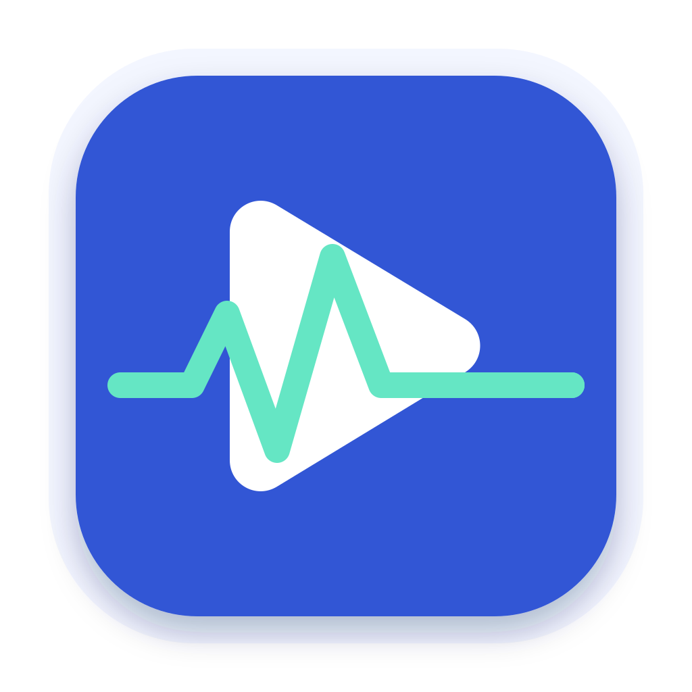
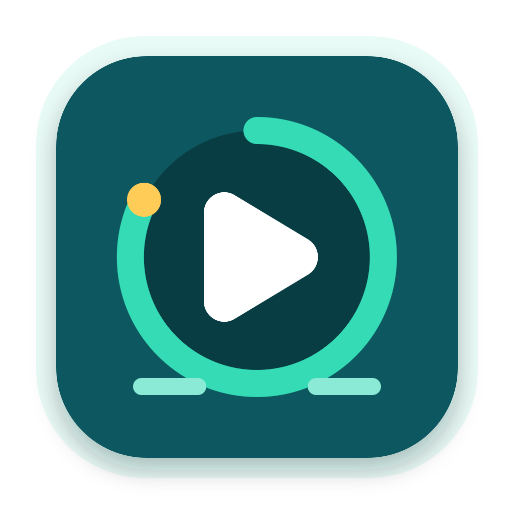
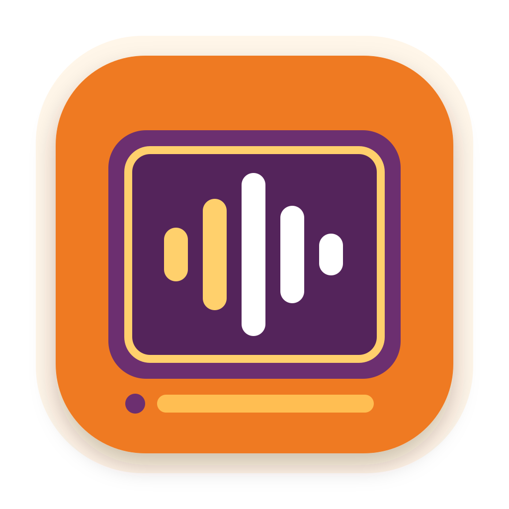
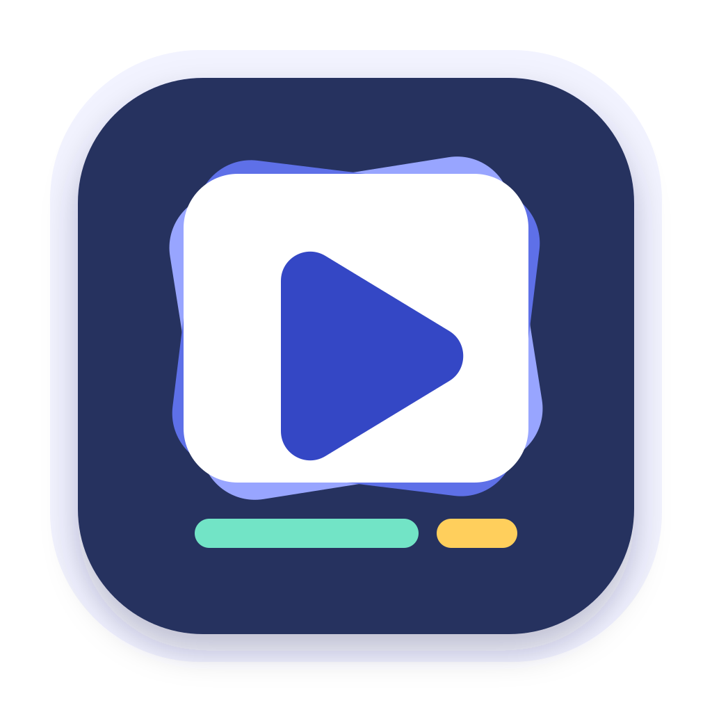
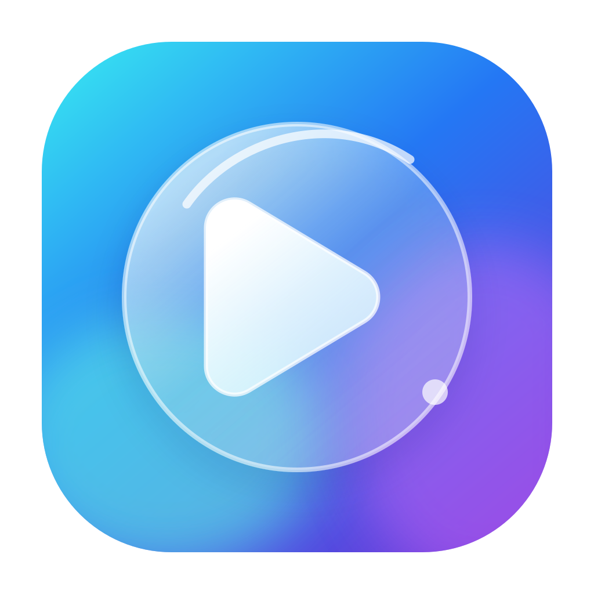
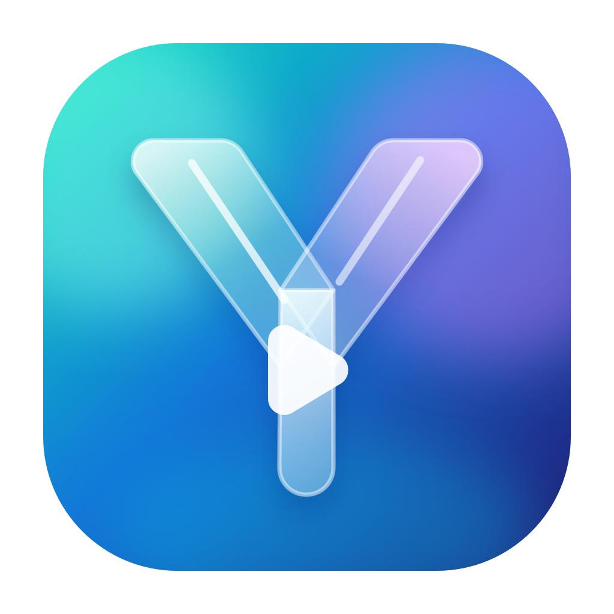
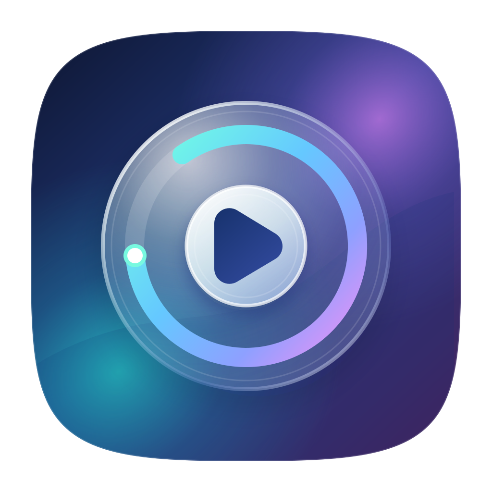
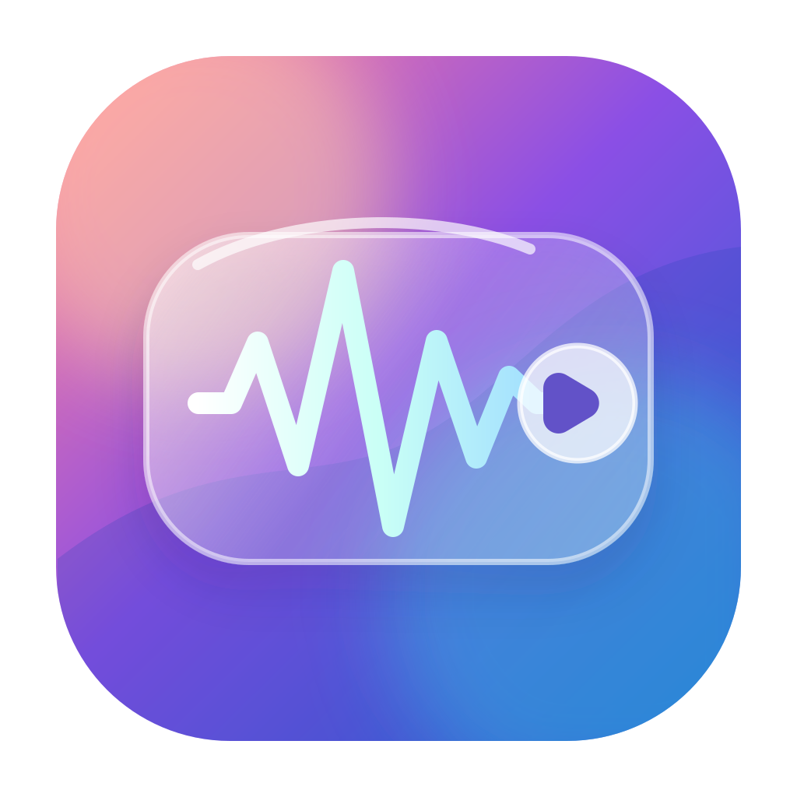
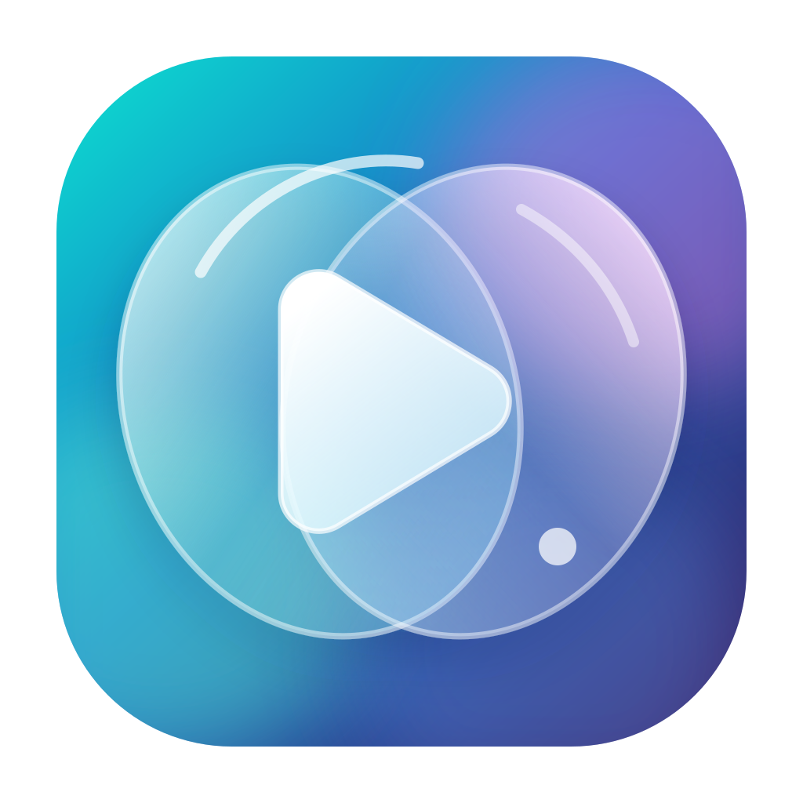

# YYPlayer 程序图标候选

本目录包含 10 个原创 SVG 图标候选，画布均为 `1024 × 1024`，未使用外部字体、位图或网络资源。

## Material Design 方向

| 编号 | 预览 | 设计重点 |
| --- | --- | --- |
| M01 |  | 播放三角 + 音频脉冲，最直接地同时表达音频与视频播放。 |
| M02 |  | 用几何 Y 字母和播放三角建立 YYPlayer 品牌记忆。 |
| M03 |  | 进度轨道包围播放键，强调精确、稳定的播放控制。 |
| M04 |  | 视频画框 + 均衡器，突出音画一体和 EQ 特性。 |
| M05 |  | 媒体卡片堆叠 + 播放键，突出本地音乐库与视频库。 |

## 液态玻璃方向

| 编号 | 预览 | 设计重点 |
| --- | --- | --- |
| G06 |  | 单枚大玻璃镜片与高识别播放符号，适合做主品牌图标。 |
| G07 |  | 两条玻璃丝带组成 Y，品牌感最强、造型更独特。 |
| G08（首选精修版） |  | 玻璃唱片与彩色播放轨道；强化小尺寸识别、精密音频和 Hi-Fi 气质。 |
| G09 |  | 悬浮玻璃控制面板与波形，偏现代桌面播放器气质。 |
| G10 |  | 双镜片交叠形成播放方向，兼顾音频、视频双重语义。 |

## 使用建议

- 当前最高候选：`G08`。已按主图标方向重新调整轮廓、比例、光学中心、玻璃层级和小尺寸可读性。
- 备选方向：`M02`、`M03`、`G07`。它们在同类播放器图标中也较容易形成自己的轮廓记忆。
- Material 组适合 Windows 开始菜单、任务栏和小尺寸文件关联图标；液态玻璃组适合大尺寸应用展示、安装器和未来 macOS 版本。
- 当前文件是方向稿。确定一个主方案后，建议继续制作 16、20、24、32、48、64、128、256 像素的逐级光学校正版本，再生成 Windows ICO 与 macOS AppIcon 资源。
- 液态玻璃组为原创设计，只借鉴半透明、折射色彩和镜面高光的视觉语言，不复刻 Apple 系统图标或第三方商标。
