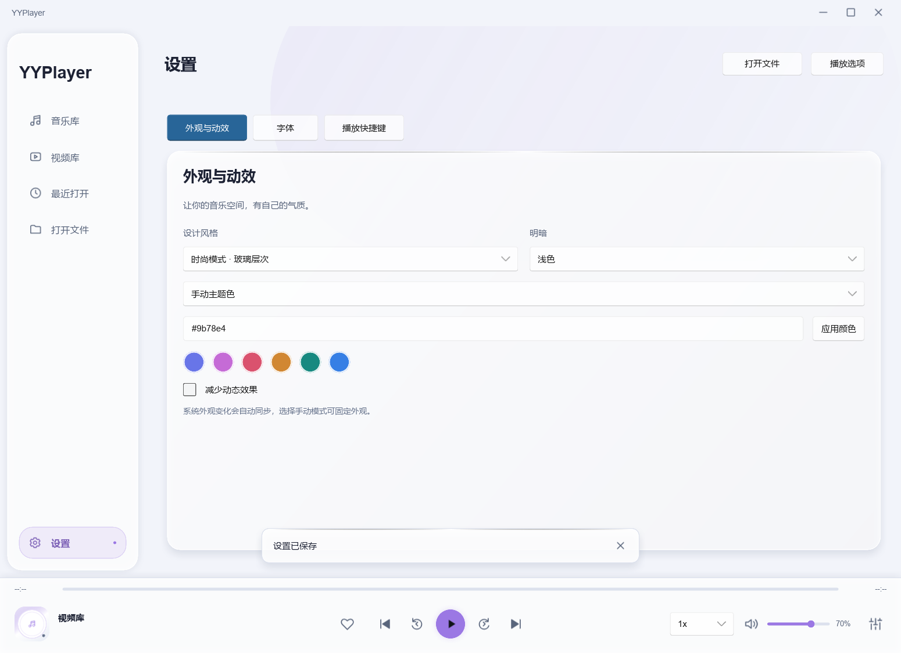
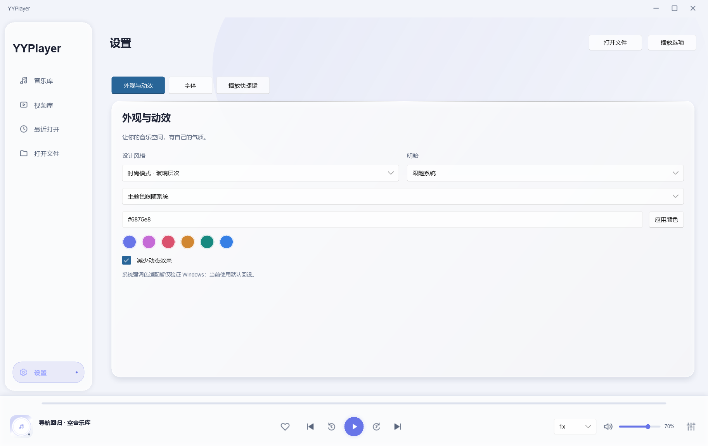

# 外观设置高度与缓存清理

日期：2026-10-02；dev 工作区。按用户截图，appearance-options.slint 将设计风格 / 明暗 / 主题色来源 ComboBox、颜色 LineEdit 与应用颜色 Button 显式固定为 34px；标签和下拉的横向行固定 60px（22px 标签 + 4px 间距 + 34px 下拉）。颜色行固定 34px，防止面板剩余高度分配给控件。没有改颜色 / 系统外观 / 保存回调、其他页面、Engine 或 GL 路径。

fmt --check、严格 workspace all-targets clippy、Debug yyplayer / library-theme / navigation-ui 构建通过。Test-LibraryTheme 13 阶段、navigation-ui 10 点通过；查看实际 FemtoVG 截图，1240×900 和 1460×920 逻辑窗口的设置页控件高度一致、文字居中、不被拉高。截图在 125% DPI，34px 对应约 42–43 个物理像素。例子使用自有 WAV / target 独立配置，没有改用户 APPDATA 或系统主题。未新增物理键鼠 / 多屏 DPI 资格；低风险固定布局变更未新增单测 / 重跑媒体解码专项。

Release 构建通过（cargo build -p yyplayer-app --release --locked --offline）。完成检查后先运行 Clean-Workspace.ps1 -WhatIf，核对实际目标均在工作区、链接检查通过、Release 不在删除列表；然后执行清理，释放 18,717,681,722 字节（17.43 GiB），没有锁定目标失败或终止用户播放器。预览 / 结果见 [预览](appearance-cleanup-preview.md) 与 [清理输出](appearance-cleanup-output.md)。

清理后 target 只保留 target/release/yyplayer.exe（22,158,848 字节），固定 DLL / headers 保留。已用 docs 下临时独立配置运行新版 Release 4 秒 smoke，Idle、正常退出 0、无引擎 / render 错误，mpv v0.41.0-1087-ge470f8986、render 创建 / 帧均 0。临时配置 / 完整设备诊断已移除，保留 [最小结果及 hash](appearance-cleanup-smoke.md)。exe SHA256 A163179DE23A8B1AB72D4F52617C50802A56C636265CC8C2C827081B8553E0A3 清理前后相同，DLL hash 与 manifest 相同。

必要布局图 / 指标已经保存在 docs。此前内存原始样本 / 测量脚本另归档 [resource-comparison](resource-comparison/README.md)；target 下构建 / 测试素材与其他可重建运行报告已清理，源码、Git、用户 APPDATA / 媒体不在清理范围。下一次 cargo build 会完整重编。

