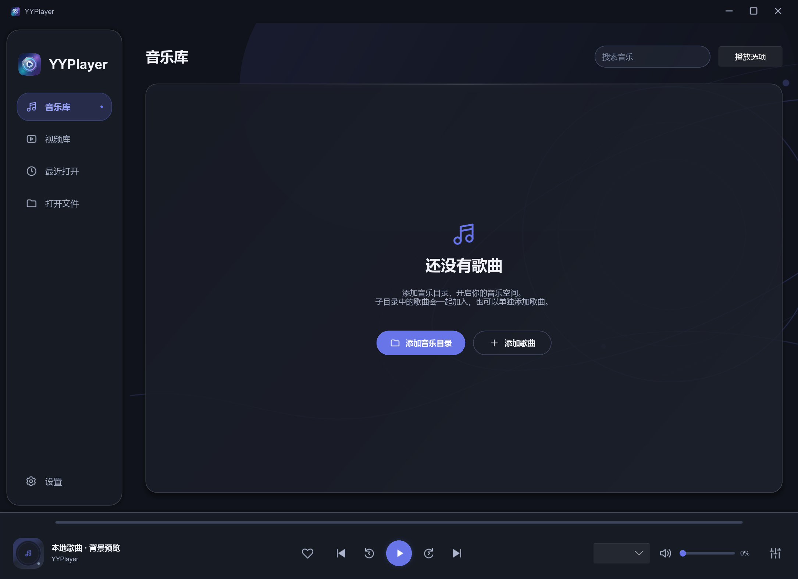
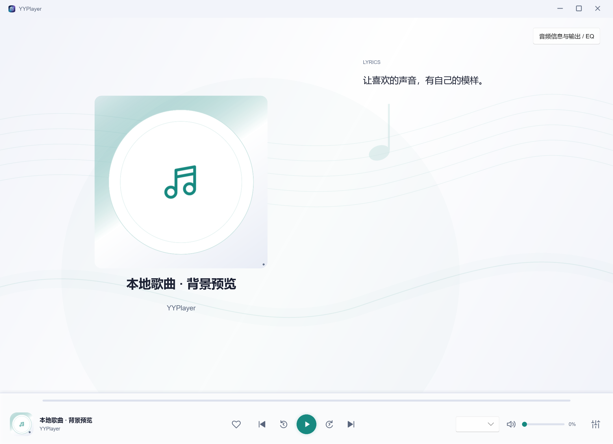
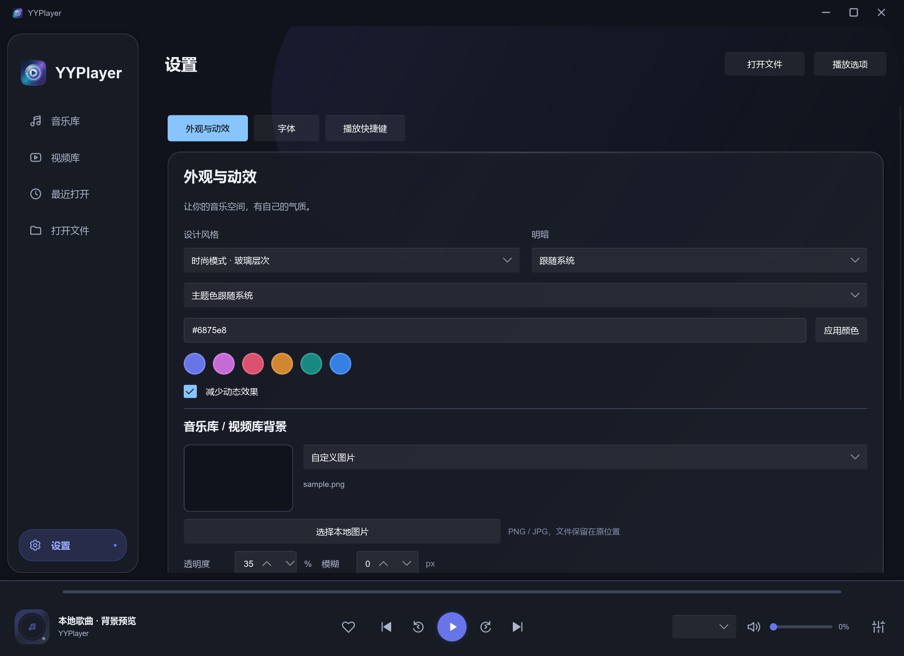
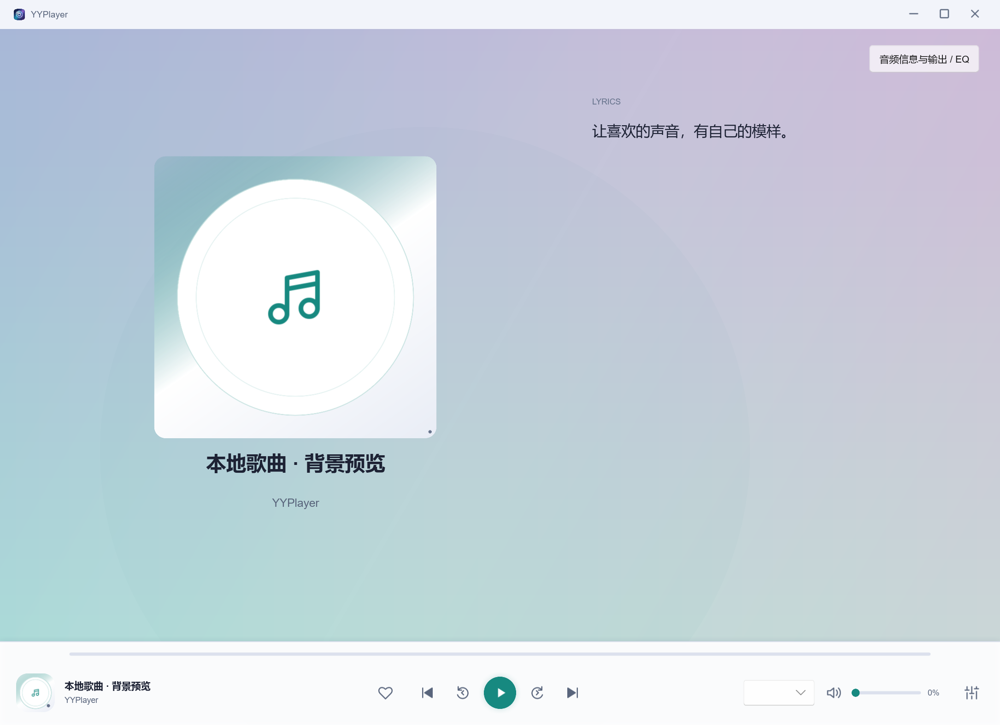

# 背景选择验收记录（2026-10-03）

## 范围

Windows x64 开发预览；音乐与视频库共享图案，歌词页独立图案。预设均为透明原创 SVG，由 Slint `colorize: Theme.accent` 着色，并根据浅深主题调整强度。自定义图片路径保留在个人设置，图片只在后台解码、缩放与模糊；图片原文件不会改写。

## 检查结果

| 检查 | 结果 |
| --- | --- |
| `cargo fmt --all -- --check`、`git diff --check` | 通过。 |
| `cargo clippy --locked --workspace --all-targets --offline -- -D warnings` | 通过。 |
| `cargo test --locked --workspace --all-targets --offline` | 通过，包含旧设置背景默认、参数边界、自有 PNG 解码 / 模糊。 |
| `cargo build --locked --offline -p yyplayer-app` | 通过。 |
| `cargo build --locked --release -p yyplayer-app --offline` | 通过。 |
| `cargo run --locked --offline -p yyplayer-app --example background-preview` | 14 个 FemtoVG 截图：8 款预设、设置页、浅色青绿主题、视频库及自绘示例图片的 35% 透明度；抽查文字 / 控件可读。 |
| `cargo run --locked --offline -p yyplayer-app --example navigation-ui` | 实际 Slint 点击、页面透明度和三尺寸布局通过。 |
| `cargo run --locked --offline -p yyplayer-app --example ui-feedback` | 状态提示、控制栏计时与中心点击回归通过。 |

## 限制

预览程序使用自有样例文本与自绘 RGB 渐变，无用户媒体或生产播放状态。自定义图片后台处理通过自有 32×32 PNG 的解码 / 模糊单测；还未用物理 OS 对话框走完整用户路径，也未在真机矩阵测试网络盘失联、不同照片、长时内存或多屏 DPI。图片大于 32 MB 或 2500 万像素会得到可恢复错误，输出最多 1920×1080；PNG / JPG 可选。其他平台未验证。
