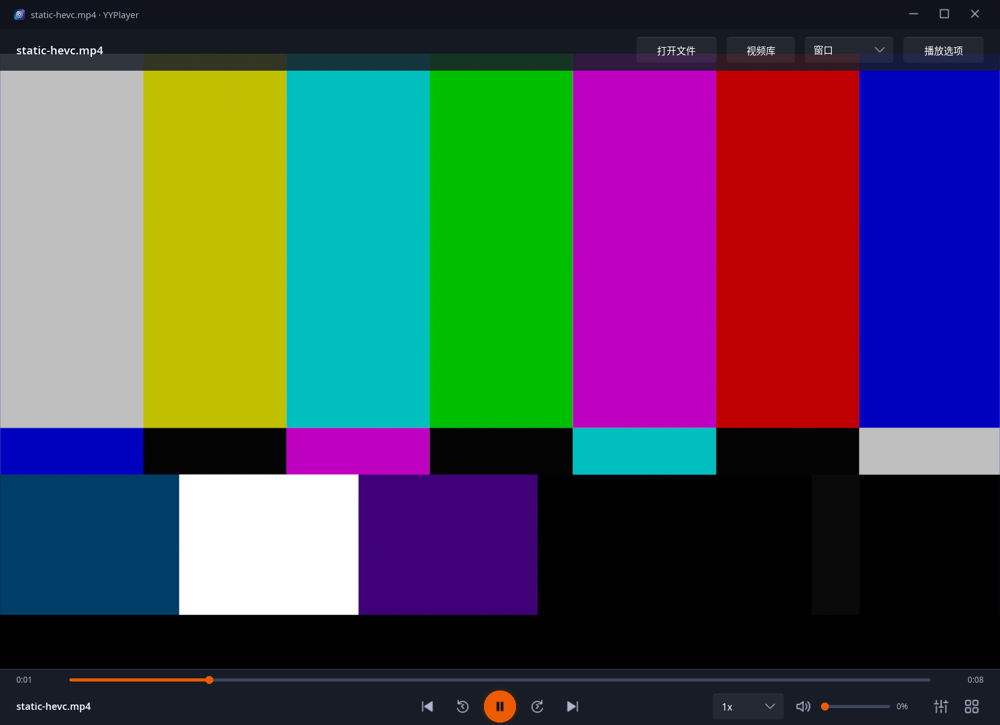
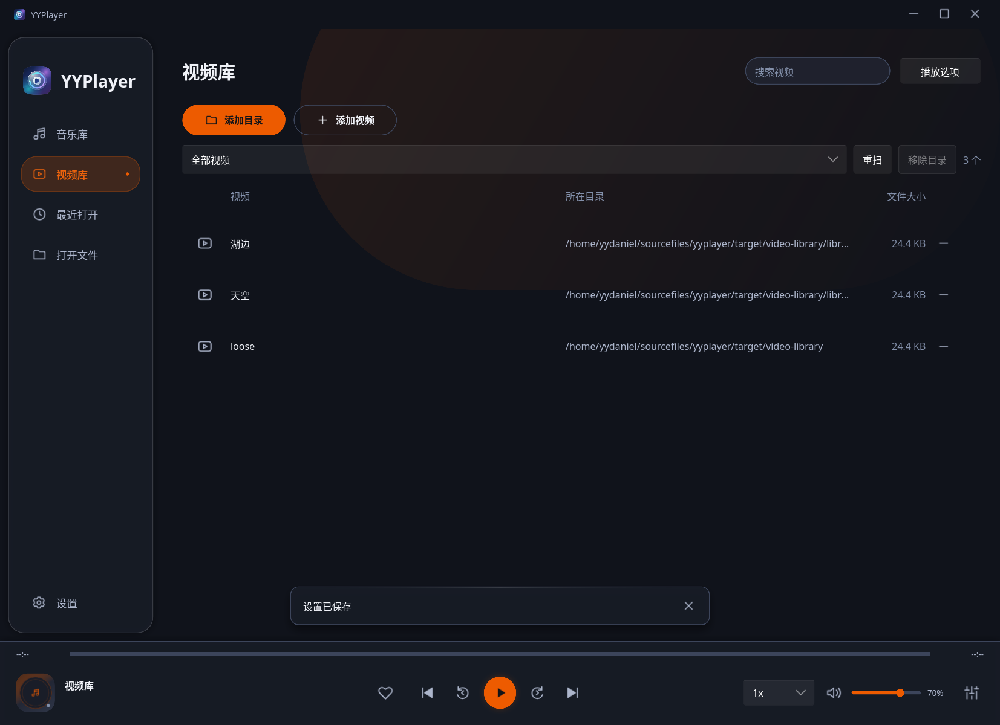
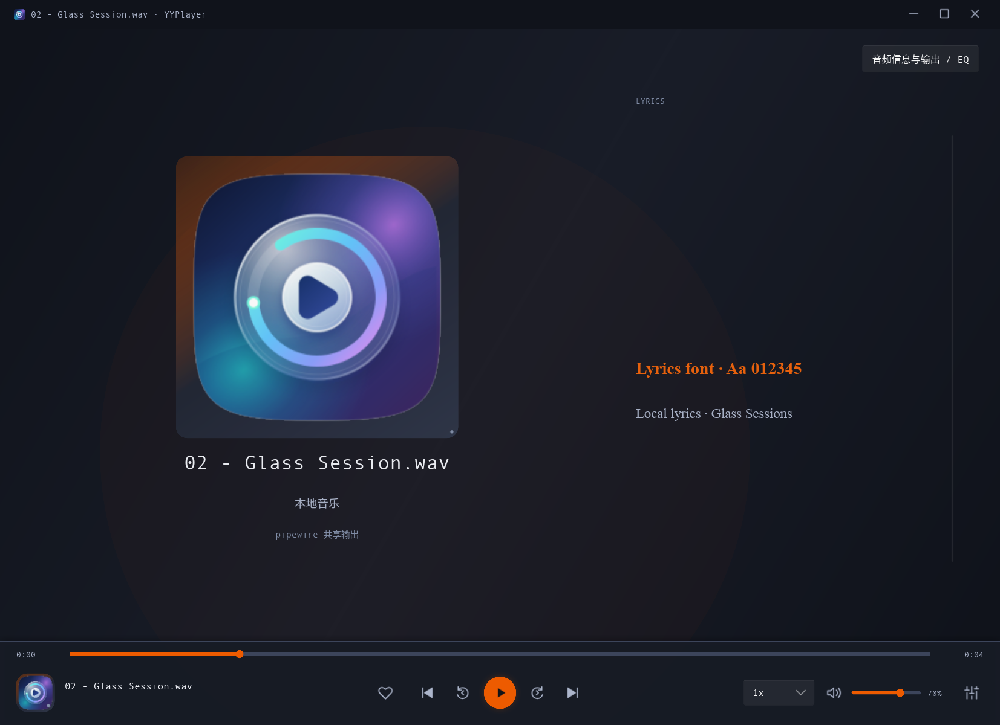

# Ubuntu 26.04 Linux 验收

日期：2026-10-03。分支 `dev-linux`，基线 master `6e9e9c42e2d7`。本轮目标为当前 Windows 开发预览的 Linux 适配和两种包，保留真实播放 / GPU 路径；架构决定见 [ADR 0007](../adr/0007-ubuntu-linux-and-packaging.md)。

## 条件与命令

本机 Ubuntu 26.04.1 LTS amd64、GNOME 原生 Wayland、NVIDIA GeForce RTX 3060 Laptop GPU / 610.57.04、OpenGL 4.6，PipeWire 1.6.2 / WirePlumber，AMD Generic 模拟输出。mpv / libmpv 为 Ubuntu 0.41.0-2ubuntu4，FFmpeg 8.0.1。另使用独立 Xvfb 验证真正 X11 后端；XWayland 的导航通过仅作为补充。Rust / Cargo 1.99.0，Slint 与 slint-build 固定 1.17.1。

apt 只读审计在安装前一次汇总缺失库，后续 `python3 scripts/check-linux-deps.py` 输出缺少包为“无”。没有由代理执行 apt 安装、改变系统主题、停止 PipeWire 或改用户默认配置。所有配置、诊断与自有 fixture 位于 target；使用静音 PCM / FLAC、原创应用图标作为封面、生成色条 / 字幕，不使用用户媒体截图。

```bash
cargo fmt --all -- --check
cargo clippy --locked --workspace --all-targets --offline -- -D warnings
cargo test --locked --workspace --all-targets --offline
cargo build --locked --offline -p yyplayer-app --bin yyplayer --examples
cargo build --locked --release --offline -p yyplayer-app --bin yyplayer
python3 scripts/test-linux.py --backend wayland --suite all --require-hardware --skip-build
python3 scripts/test-linux.py --backend x11 --headless --suite ui --skip-build
python3 scripts/test-linux.py --backend wayland --suite alsa --alsa-device 'alsa/hw:CARD=Generic,DEV=0' --skip-build
python3 scripts/package-linux.py --offline --skip-build
python3 scripts/test-linux-packages.py --backend wayland
```

本环境直接调用 stable toolchain 的 cargo / rustc，Cargo 缓存限项目 target/cargo-home；没有依赖 rustup shim 的全局写操作。报告中的结果按对应实际运行归档，不把脚本存在当成已经通过。

## 已验证的功能组合

| 范围 | 证据与实测口径 |
| --- | --- |
| 启动 / 普通音乐 | 系统 libmpv ABI 初始化、真实 FLAC 播放与位置前进，标签 / 内嵌封面 / 6 行 LRC；音频和 Idle 的 libmpv renderer 创建均为 0；正常资源清理退出 |
| 原始路径 | 带 `0xff`、空格、`%?#` 的真实文件名播放；core 配置 / 索引 / EQ / 歌词绑定 / 背景路径无损往返与旧路径碰撞边界单测 |
| 桌面音频 | 实际 PipeWire 共享 / 严格独占流；Pulse 共享与严格拒绝 / 优先回退同设备；检查实际 AO；保存设备失联时启动保持 Idle、0 tracks、无 API 输出格式、可见错误，未初始化默认输出；7 步生产音频控制脚本验证全局 / 设备 / 单文件 EQ、平直移除滤镜和模式恢复 |
| ALSA 直连 | 指定 `hw:CARD=Generic,DEV=0`；真实 busy 打开失败且未自动换设备；空闲时成功 Final HW params、实际 ALSA AO 和播放。实测源 44100 Hz / API 48000 Hz / s16；严格源率保护保持 Paused、位置 0.000396 秒。不能宣称 DAC 物理格式或位准确 |
| 视频控件 | 真实 11 动作脚本，暂停、定位、倍速、音量 / mute、窗口 / 全屏及解码重载位置恢复；不是单纯状态机模拟 |
| 视频库 / 生命周期 | 21 阶段生产 controller：实际行 / 返回点击，视频 / 音乐缓存分离、筛选 / 搜索 / 移除、位置恢复、10 次创建销毁、快速请求取消；普通和 EOF 重播后的 10 个暂停 / 继续子步骤，位置冻结 / 增长、generation / renderer 不重建 |
| 音乐库 / 外观 | 13 阶段真实目录导入 / 去重 / 筛选 / 播放、移除后继续、重扫 / 取消、设置保存和四种主题；portal 实读 dark=true / accent=ed5b00 |
| 字体 / 字幕 / UI | 22 阶段生产例子：325 字体、实际下拉事件、歌词 / SRT / ASS 字体与作者覆盖恢复、列拖动 0.46→0.56 / 保存、80→79 行、缩略图、封面返回、静默播放保存、最大化 / 还原 / 关闭 |
| 界面回归 | Wayland 与独立 X11：navigation-ui 10 点、ui-feedback 17 点、audio-ui 5 图 / 封面与歌词点击、背景例子 8 个图案 / 自有本地图片；透明度 / 三尺寸几何与覆盖控件计时断言 |
| 4K GPU 图像 | 自有静态 3840×2160 HEVC：软件、NVDEC、NVDEC+去色带分别采集一次真实 GPU 图像并比较视频区域；不是生产 CPU 回读 / 上传循环 |

4K 素材 SHA-256 `f41a5315ece6510bc3450f1792f975ebf36f24aa4bca1dad664b42d0bc440929`。最终完整顺序验收软件 / 去色带 / 硬解为 169 / 179 / 180 次 render，NVDEC 对软件平均 RGB 差 0、明显偏差像素 0；去色带差 0.230387、明显偏差 0。阈值平均误差≤1.5、通道差>12 的像素占比≤1%；运行明细与截图见本目录 linux-results.json / linux-gpu.png。帧数仅证明播放，图片比较才证明本素材画面一致；这不是性能、功耗、零拷贝或 HDR 证据。







## 本轮修复暴露的问题

1. Linux 加载器原先只能显式覆盖 Windows runtime 路径；补系统绝对库 / 可验证 AppImage bundle，缺包返回可恢复初始化错误。
2. 强制 AO 列表令 ALSA 请求误走 PipeWire。移除该覆盖，增加实际 AO / 硬件打开证据，不能把错误路由后的失败算作 ALSA 资格。
3. 非 UTF-8 文件的 FILE_LOADED 比较误用显示字符串，且 file URI 会由 mpv 解码为实际字节；使用复制的原始 C bytes 比较，配置用无合法文件名碰撞的特殊编码。
4. Wayland 同步截图延迟 queued UI timer 时，导航 / 库验收过早检查透明度；等待实际状态完成并保留超时，生产淡入不更换为假状态。
5. 最后一个视频窗口 hide 时，Slint suspend 持可变 backend borrow，teardown 设置图片触发 RefCell 重入 / 退出崩溃；hide 前清 UI 引用、teardown 只释放 GL。失败运行保留在 target，不计通过；修复后回归正常退出。
6. 保存设备策略原先由首次 UI tick 发送，早于 tick 的启动文件加载可能先走默认音频。Linux 将设置排在首次 Load 前，Engine 先枚举真实设备；不可用请求保留 blocked，pending_load 期间仍显示全局输出错误。真实失联配置验证没有音频 AO / 轨道初始化，不只检查暂停状态。

## 安装包与源码

deb 装载系统 libmpv；AppImage 按 SHA-256 验证捆绑 libmpv，附 ELF 依赖、SPA / PipeWire 模块、完整发行包 copyright、Rust 原文与 source manifests。GPU / GL 驱动、glibc 和桌面服务由宿主提供。两包不删除设置 / 媒体，不更改默认音频设备和文件关联。构建工具与 type-2 runtime 源码归档均锁定 hash，源码包包含本次 dirty 工作树。

deb 提取版、AppImage 提取版和实际 FUSE 直接启动的真实音频 / 4K NVDEC 播放、正常退出通过；最终包各自视频为 190 / 188 / 191 次 render，不作性能比较。AppImage 捆绑 EQ / 独占恢复 7 步通过，保存设备失联拒绝且无默认音频初始化。六个产物 SHA-256 通过；损坏临时 bundle manifest 拒绝初始化，不悄悄回退系统库。包 / source-kit 离线解析结果保存在 linux-results.json；提取目录为临时 target 目录，没有 root 安装。源码包离线准备核验完整 614 个锁定 crate 归档，包含其他平台条件依赖，生成 vendor checksum；使用独立空 Cargo home 验证五 crate 的 locked / offline 依赖图可解析。这不是再次执行源码包完整编译。Actions workflow 仅实现，未在 GitHub runner 上执行或推送。

## 未验证条件与下一步

- USB DAC 设备矩阵、拔插、成功实际独占→共享竞争回退、数字捕获位准确、广泛 PCM / 多声道 / SPDIF，不能由本机 Generic 或 PipeWire exclusive 推断。
- HDR 显示输出、AMD / Intel / VA-API、其他 compositor、真实 Xorg 显示 / GPU、跨屏 DPI / 睡眠 / 长时性能；Xvfb 布局不替代这些。
- 物理快捷键 / 输入法 / 拖放与文件选择器逐项点击、窗口拖动 / 边缘缩放、Wayland 最小化 / dock 恢复。Wayland 自动例子把 minimize_confirmed 记 false，DWM 结果记 null；Linux 圆角 / 阴影由 compositor 决定。
- deb 真正安装 / 升级 / 卸载、首次文件关联、干净系统启动、老发行版 AppImage；本轮目标 Ubuntu 26.04 amd64，不扩大适用平台。
- 正式二进制发行：上游 AppImage runtime 的 Alpine 静态版本 / 可重链接源码安排仍待补证，见 runtime-notices/README.md；Windows 固定 DLL 闭包仍有原有未完成条件。

下一具体动作：在独立 Ubuntu 测试用户 / VM 安装两种包并验收物理对话框、快捷键与窗口动作，再用真实 USB DAC 做源 / API / 捕获格式和失联恢复矩阵。Windows 本轮没有构建环境，只保留 cfg / 原策略，未新增 Windows 回归通过结论。
