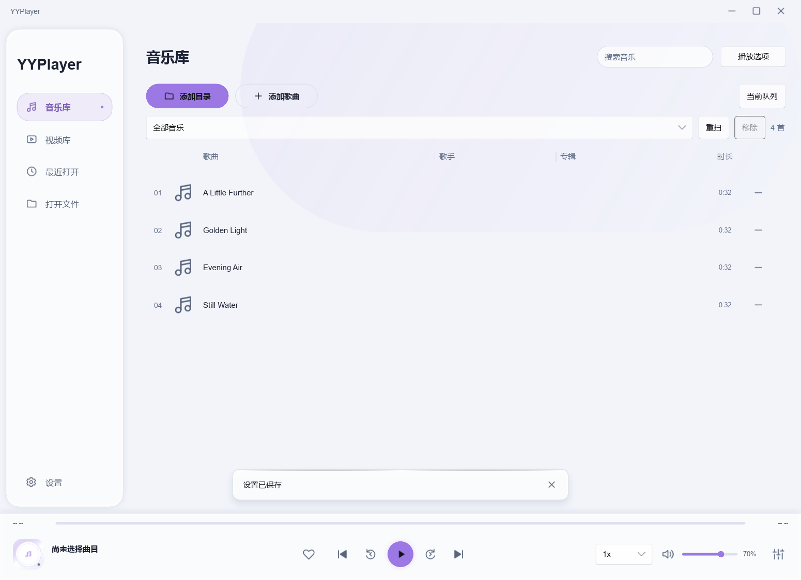
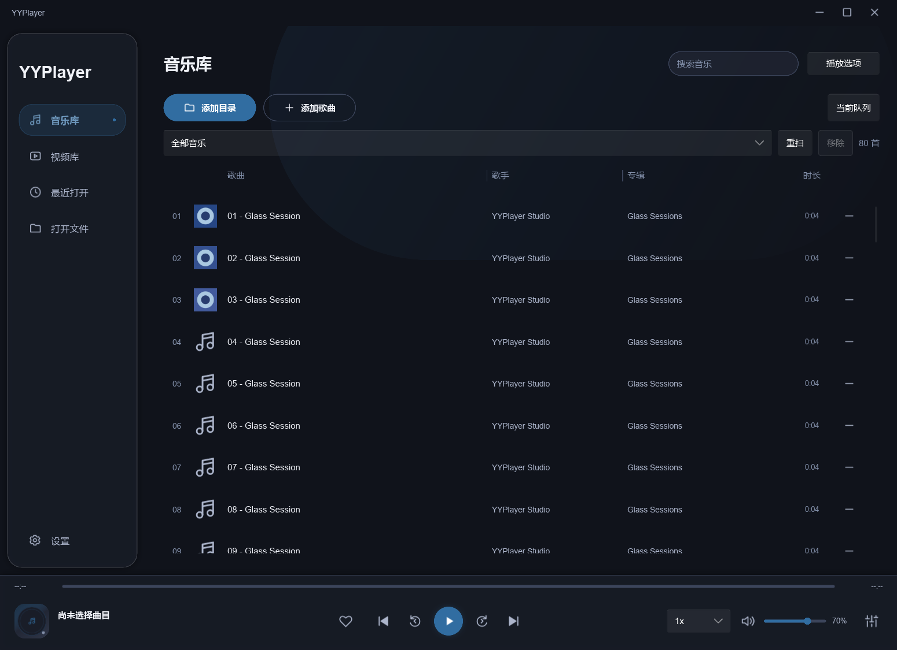
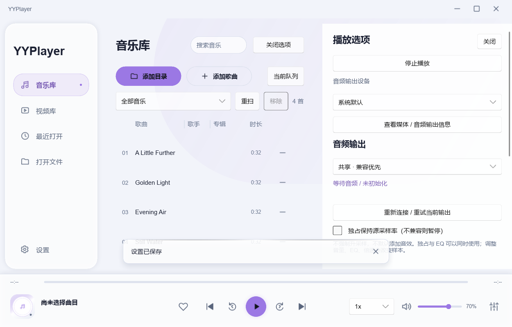
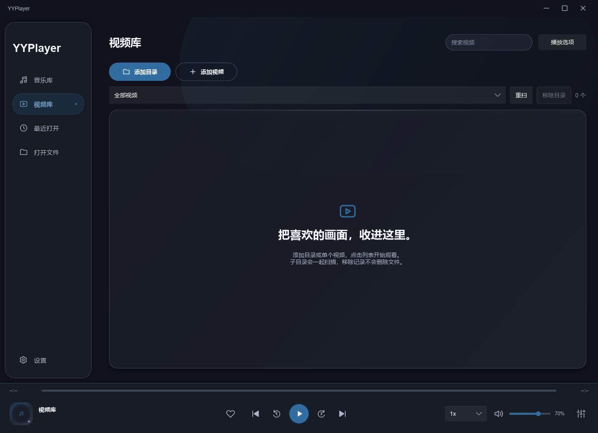
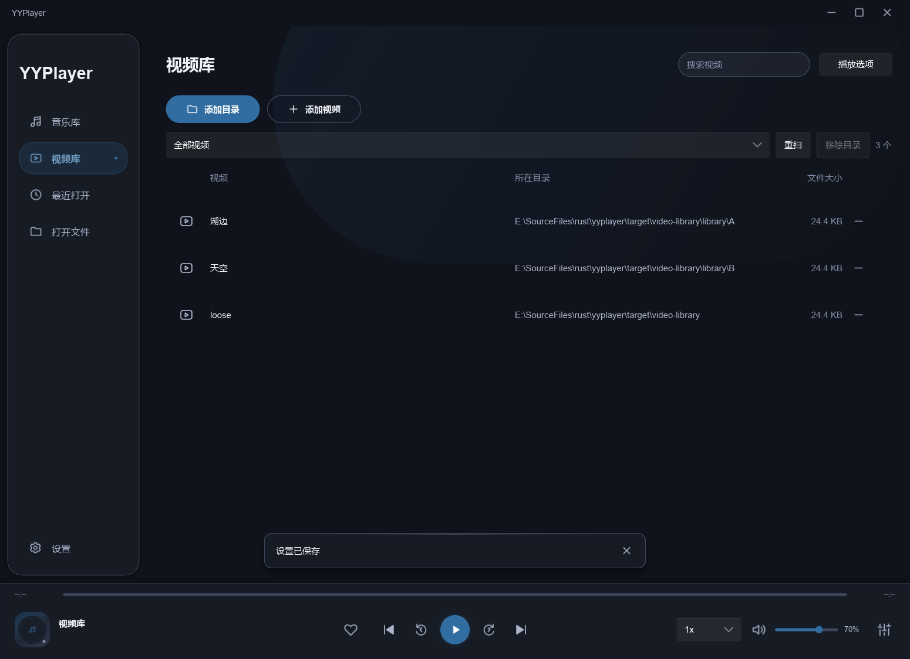
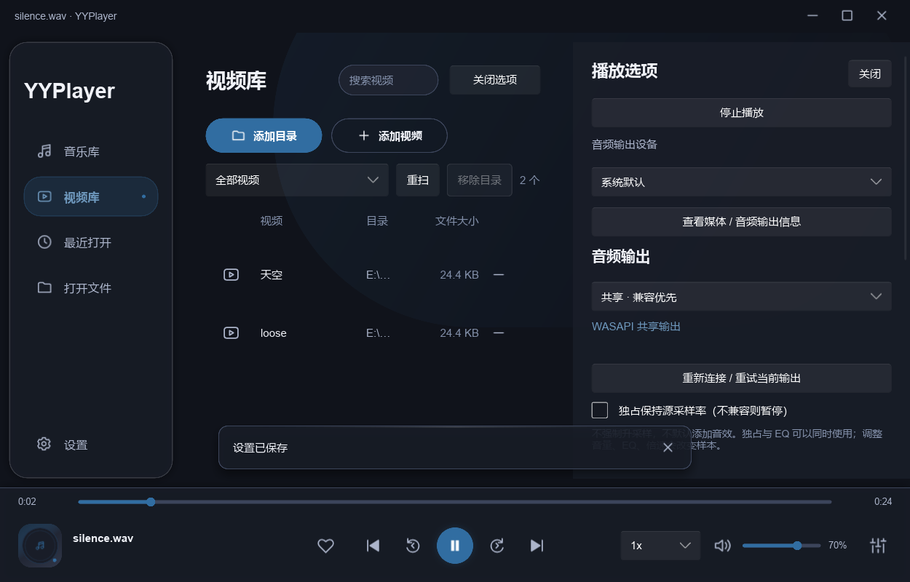

# 媒体库 UI 精简验收

日期：2026-10-02。范围：dev 工作区，按用户两张框选截图精简音乐 / 视频库界面。

## 修改

删除音乐库顶部宣传卡片（英文标语、主副文案、卡片装饰）、库内重复“音乐库 / 播放队列”标题及索引 / 扫描说明行；删除视频库的“本地视频”标题和索引说明行。保留框外数量，合并至目录筛选工具栏，不留下原说明行的空白占位。侧栏、页面主标题和无媒体播放栏统一显示“视频库”。保留未被框选的空库引导、添加、搜索、筛选、重扫 / 取消、移除和播放操作。

改动 music.slint / video-library.slint / app.slint、shell.rs 的对应属性投影和 controller.rs 的空闲标题。删除不再使用的宣传卡片 compact 属性和可见说明属性；后台索引 / 诊断信息仍保留。列宽拖动和列表首行上移，ui-customization / video-library 的实际 Slint 点击坐标同步调整。没有改动 Engine、GL presenter、解码 / 音频策略或用户配置。

## 检查

| 检查 | 结果 |
|---|---|
| cargo fmt --all -- --check | 通过 |
| cargo clippy --workspace --all-targets --locked --offline -- -D warnings | 通过 |
| cargo test --workspace --all-targets --locked --offline | 26 个独立测试通过，例子重复测试不另计 |
| cargo build -p yyplayer-app --bins --examples --locked --offline | 通过 |
| cargo build -p yyplayer-app --release --locked --offline | 通过 |
| Test-UiCustomization.ps1 -SkipBuild | 22 阶段通过，包括新位置的真实列宽拖动 / 移除、封面、歌词、窗口按钮与保存 |
| Test-LibraryTheme.ps1 -SkipBuild | 13 阶段通过，音乐库操作及简洁 / 时尚、浅 / 深主题 |
| Test-VideoLibrary.ps1 -SkipBuild | 20 阶段通过，包括新位置列表点击、返回 / 恢复、10 次释放 / 重建、快速取消及损坏视频恢复 |
| navigation-ui / ui-feedback / audio-ui | 10 点 / 17 点 / 五图及封面、歌词点击通过 |
| git diff --check、源码旧名称 / 宣传文案检索 | 通过 |

已目视检查音乐库浅色 / 深色、1000×640 最小窗口和选项面板，视频库空页 / 有内容 / 最小面板截图：列表上移、数量和按钮不重叠、页宽正常、无框出说明、标题统一。环境与固定 runtime 沿用 [视频库报告](video-library.md)。素材全部自行生成，独立 target 配置，没有复制用户媒体或操作 APPDATA。图片是 Slint / GPU 布局证据；物理键鼠、文件对话框和多屏 DPI 尚未新增资格。本轮仅 UI 和文字修改，没有重跑 4K 像素 / 数字捕获 / 内存专项，不将上一轮内存数字当作新版精简 UI 的重新测量。

## 图片

