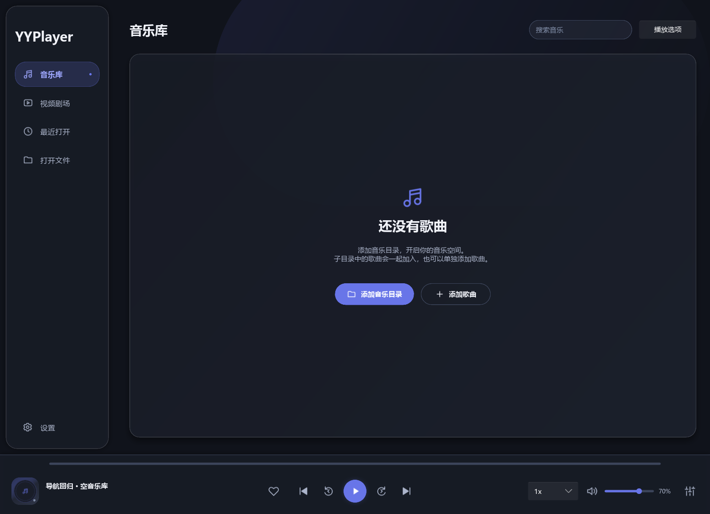

# 主界面空白、侧栏布局与工程清理

日期：2026-10-01。Windows 本机开发预览；本轮未改变音频输出策略、EQ 或 mpv 渲染边界。

## 原因与修复

Slint 1.17.1 的 Timer.restart 只重启曾经启动的计时器。页面进入计时器初始 running=false；切页把 page-arrival 置 0 后只调用 restart，导致内容持续透明。原生 Winit + FemtoVG 实际复现：进入音乐库和设置 800ms 后仍 opacity=0。现在显式 start，单次触发恢复透明度，减少动态效果时停止计时器、立即显示。

音乐页子控件的 max-width 还向上传递到主布局：1240px 窗口中的主内容只有 394px，选项栏因此出现在中间。现在使用显式可伸展的 Rectangle 内容容器隔离宽度约束；主内容为 1038px，打开 370px 选项栏后为 656px，加上 12px 间隔恰好占满右侧空间。

无启动文件时首页进入音乐库。空库提供居中图标、无歌曲说明、添加目录 / 单曲按钮；隐藏空库中无意义的筛选工具。已配置目录但没有结果时保留筛选 / 重扫入口。删除导航版本小字；时尚模式上、下均留 10px。视频页面保持原尺寸与覆盖控制栏。

## 验证范围

新增 navigation-ui 使用实际 Slint PointerPressed / PointerReleased，通过 Shell 的回调与投影切页，不是只检查 controller.page。无媒体 / 假播放；按钮回调计数只证明事件接通，不冒充实际 OS 文件对话框导入。

10 个检查点通过：视频顶部媒体库、设置导航、音乐导航、空库添加目录按钮、底部播放选项、三种尺寸、减少动态效果 / 浅色、简洁模式。所有稳定页面 opacity=1；时尚底部留白断言通过。

| 窗口逻辑宽度 | 音乐内容宽度 | 选项栏 |
| --- | --- | --- |
| 1240 | 1038 | 关闭 |
| 1240 | 656 | 右侧 370px |
| 1000 | 416 | 右侧 370px |
| 1460 | 876 | 右侧 370px |

以下图片是无媒体界面验证，不是音频设备资格证据：

检查命令：fmt --check、严格 workspace all-targets clippy、workspace all-targets tests（16 个独立测试通过，例子重用测试不重复计数）、navigation-ui（10 点）、ui-feedback（17 点，实际 Slint 点击 / 超时 / 视频尺寸）、Test-LibraryTheme（13 阶段，生产 controller / Engine / GPU presenter、自有 WAV 真实播放）均通过。Release 构建与清理后的启动结果见下方完成记录。

上一轮目录 / 主题报告没有断言进入后的透明度与主内容几何，漏掉了本次问题。此报告补足该范围。OS 文件选择的人工操作、多屏 DPI、其他平台仍待验；本轮未重跑音频数字捕获或 4K 像素资格测试。

## 清理规则

新增 Clean-Workspace.ps1；-WhatIf 已检查清单，路径限定工程内，拒绝 junction / symlink，先核对全部目标后删除。清理 target 的 debug / release 中间产物、验收临时目录和旧 exe / PDB，以及 libmpv 下载 archive / 未使用导入库。保留新版 target/release/yyplayer.exe、固定开发 DLL / 头文件、源码 / Cargo.lock / Git、docs 验收记录；不访问 APPDATA 或用户媒体。

清理前 target 为 28,122,531,599 字节（26.191 GiB），其中 debug 约 24.11 GiB。后续检查新增的产物也纳入最终清理。临时素材和原始截图可通过仓库脚本重新生成，历史验证总结仍保留在 docs。下一次构建会重新生成缓存。

## 完成记录

最终 Release 构建通过，exe 20,774,912 字节，SHA256 `3c23261e9b23ac2fef753cf7810605966c241a18d98efa85460a0238e459a4ff`。清理前、清理后均以独立 YYPLAYER_CONFIG、4 秒 smoke 启动空库：page=0、phase=Idle、固定 mpv v0.41.0-1087-ge470f8986，error / render_error 为空、exit=0。测试后再次清除独立验证目录。

实际清理移除 28,873,858,504 字节（26.89 GiB），工程所有文件长度之和由 29,040,684,385 降至 166,825,881 字节（159.1 MiB；测量含 Git 和文档，后续提交会略变）。全部清理目标成功，无被锁定残留。target/release 只保留新版 exe；固定开发 DLL SHA256 校验仍匹配 manifest。数字为目录文件逻辑长度之和，不是磁盘分配块或性能指标。
