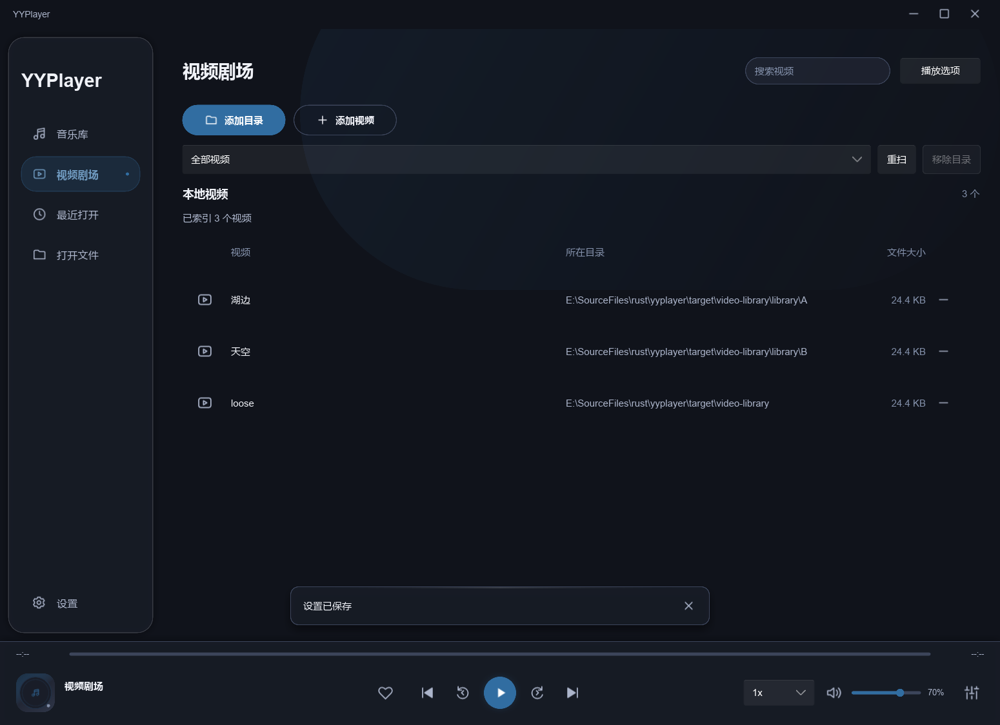
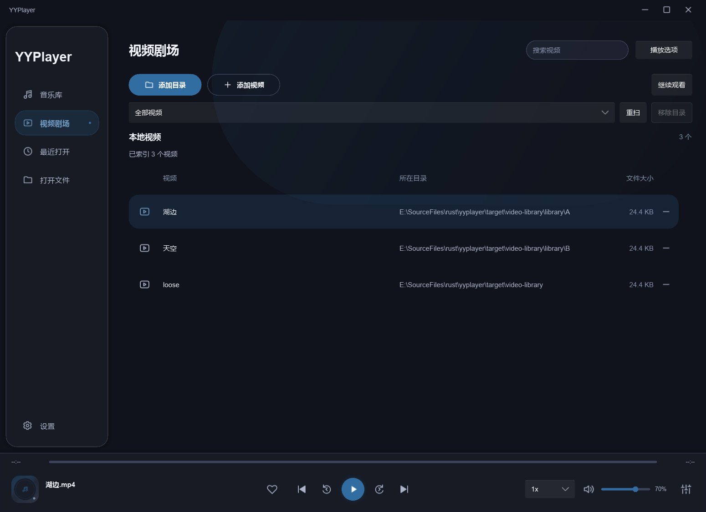
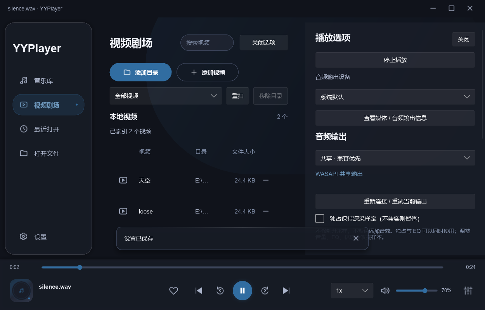

# 视频库与按需视频渲染验收

日期：2026-10-02。范围：dev 上的 Windows 开发预览；设计见 [ADR 0006](../adr/0006-video-library-and-lazy-rendering.md)。

## 结果与实现

视频剧场导航进入视频库，支持目录 / 多个单文件、递归扫描、去重、搜索、目录筛选、重扫 / 取消、移除及重启恢复。视频设置和索引独立于音乐库；移除记录不删除文件，也不改动已经建立的播放队列。列表使用虚拟化 ListView，索引仅读取文件名 / 目录 / 大小，不解码视频或生成缩略图，不显示虚构时长。

点击条目进入同窗口独立 VideoPlayer / VideoPlayerToolbar。返回库保存本次媒体和位置后 Stop，恢复临时倍速并退出全屏；Engine 确认实际 current-vo 已关闭后，GL notifier 清除 Slint 图片引用、render_free 并释放 FBO / texture。继续观看或再点同项重建并恢复位置，续播位置仅本次运行有效。

Engine 初始 vid=no；音频不等待 renderer，视频等待 render 租约 ready 才启用输出。VideoGate 合并旧等待请求，音频 / Stop / 禁用视频取消旧视频请求。普通命令维持 Engine 线程；64 项普通命令 + 1 个 Stop 保留槽，Shutdown atomic；Stop 不丢弃队列中的设置或临时倍速恢复。GL prepare_gl、串行 render、同上下文与先 render_free 后 core 销毁边界保持。

主要改动：player-core 的库配置 / Load 意图 / 快照；player-mpv worker / video_gate；app 的共享后台 library_service、video_controller / controller / bootstrap；player-ui 的库页、播放器组件、shell / view model / presenter；新增 video-library 生产流程例子和 Test-VideoLibrary。navigation-ui 更新导航目标；audio-ui 修正原测试硬编码歌词坐标，依据实际窗口几何点击。未增加依赖或修改固定 runtime / 解码默认 / 音频默认 / 用户 APPDATA。

## 环境与素材

Windows 11 x64，AMD Ryzen AI 7 H 350 / Radeon 860M，约 32GB RAM；NVIDIA RTX 5060 Laptop（32.0.16.1088）及 AMD Radeon 860M（32.0.31041.1004）。UI 默认 Winit + FemtoVG，1240×900 逻辑像素，125% DPI 对应 1550×1125 截图；最小测试窗口 1000×640，开启选项后仍保留视频列表。

Slint / slint-build 1.17.1，固定 mpv 20260928-git-e470f8986e，运行时 mpv v0.41.0-1087-ge470f8986；DLL hash 由 manifest 锁定。render.h 关于创建时序与 render_free 的约束按 [固定源码](https://github.com/mpv-player/mpv/blob/e470f8986e/libmpv/render.h) 核实。

全部素材自行生成，没有读取或复制用户的锦城湖视频或截图，没有改用户默认设置。视频库 fixture 为 24 秒 1280×720 / 30fps H.264、无音轨，SHA256 D7E0E0F9964E1D5425418B69395D5B92A944858313CBFA8F8E5FA9949178DAE6；目录 A / B 和单文件为同一素材副本。另有静音 WAV 和故意损坏的 MP4。4K 图像 fixture 为 3840×2160 / 30fps HEVC 静态色条，无音轨，SHA256 3cbbf6d3a5d62541a5574528b224802acbd586338625c4dcf889193ced65ecd2。

## 检查与真实流程

以下检查均通过。测试例子复用生产 controller / Engine / GPU presenter，输入点击使用 Slint 测试接口；不是物理键鼠 / OS 文件对话框验收。

| 命令 / 场景 | 结果 |
|---|---|
| cargo fmt --all -- --check | 通过 |
| cargo clippy --workspace --all-targets --locked --offline -- -D warnings | 通过 |
| cargo test --workspace --all-targets --locked --offline | 26 个独立测试通过；例子重复包含的同一测试不另计 |
| cargo build -p yyplayer-app --bins --examples --locked --offline | 通过 |
| cargo build -p yyplayer-app --release --locked --offline | 通过 |
| scripts/Test-VideoLibrary.ps1 -SkipBuild | 20 阶段通过；空页 / 导入 / 搜索 / 筛选初始 render 创建 0，真实条目 / 返回点击、seek / 恢复、10 次循环、快速取消、音频切换、移除不删文件 / 不停音乐、重扫取消、索引重启恢复、最小布局、损坏视频后音频恢复 |
| scripts/Test-Video.ps1 -SkipBuild | 11 动作通过，NVDEC、暂停重载保留位置、设置保存 / 软件解码 / 全屏 / 正常退出 |
| scripts/Test-Render.ps1 -SkipBuild | NVDEC / 软件 / 去色带实际 4K GPU 图片比较通过，平均 RGB 误差分别 0 / 0.205388，明显偏差比例均 0 |
| scripts/Test-UiCustomization.ps1 -SkipBuild | 22 阶段通过 |
| navigation-ui / ui-feedback / audio-ui | 10 点 / 17 点 / 5 张布局及封面、歌词点击通过 |
| scripts/Test-LibraryTheme.ps1 -SkipBuild | 13 阶段通过，音乐库 / 多主题回归 |
| scripts/Test-Audio.ps1 -SkipBuild -Player target/release/yyplayer.exe | FLAC / 封面 / LRC、共享 / 严格 WASAPI、分级 EQ、正常退出通过；768kHz 源协商 384kHz 时按策略暂停 |

关键修正：仅暂停再关闭 vid 会让无音轨视频进入 Ended，改为保存位置后停止 / 恢复；释放条件改为每次回读实际 current-vo，避免旧标志残留；坏视频处理核对当前媒体身份，避免过期错误取消新加载。首轮失败不计作通过，修正后的完整流程复跑通过。

生命周期记录见 [video-library-results.json](video-library-results.json)，4K 图像指标见 [video-library-gpu.json](video-library-gpu.json)。原始 fixture / trace / GPU 图片在 target 下，可由脚本重建，不提交媒体。

## Release 资源观察

使用相同自有 12 秒 44.1kHz stereo PCM WAV、固定 runtime、默认窗口 / WASAPI 共享 / 无 DSP / 70% 音量和独立初始配置，逐次启动旧 / 新 Release。每 500ms 读进程 WorkingSet64 / PrivateMemorySize64，取启动后 3–7 秒的中位数（各 8 点），8 秒 smoke 自动正常退出。WAV SHA256 EFBF40F365EDF28A99F1796F00E9F232B4AE1764118AE7E8E9F59E6ACB2C4E01。

| 口径 | 旧 Release | 本轮 Release |
|---|---:|---:|
| 进程 Working Set | 227.65 MiB | 110.46 MiB |
| Private Bytes（私有提交量） | 384.91 MiB | 163.40 MiB |
| libmpv render 帧 / 创建次数 | 3 / 旧版无计数 | 0 / 0 |

新版诊断 ready=false、video_output_enabled=false，两版正常退出。可归因的结构变化是音乐不再创建视频 render context；Slint 界面自身仍使用 OpenGL。该串行短样本受驱动 / 分配器 / 后台活动影响，不能外推为所有音乐 / 4K 视频或 PotPlayer 对比；本轮没有对用户 4K 素材进行内存基准，不混用 Debug 或 GPU 专用显存。工作集与私有提交量是不同指标，不对应同一任务管理器列。

可审查汇总见 [video-library-memory.json](video-library-memory.json)，包含两版 exe / 素材 hash。原始样本和 Measure-Old / Measure-New 脚本清理前已归档到 [resource-comparison](resource-comparison/README.md)；旧 exe 在测量后被新的 Release 构建替换，旧样本保留，未声称可从当前工作区复跑旧二进制。

## 已知边界与下一步

本轮完成上述功能与本机验收。没有视频时长索引 / 视频缩略图、实时目录监听或 DB，超过既有 20000 媒体 / 200000 项 / 64 层限制需要拆分目录。OS 文件对话框未做物理操作，大库 / 长时内存趋势、快速连续文件对话框、网络盘 / 失联目录视频专项、睡眠 / 多屏 DPI / 多 GPU 和其他平台仍待补证据；GL 初始化能力缺失的真实驱动场景也未制造。已有目录 / 缓存取消等单测不能替代这些真机资格。下一步按自有大库和长时间循环补内存 / 响应 / 退出证据，再按原音频计划补 USB / 数字捕获；本轮未新增 HDR 或位准确资格。

## 界面证据

