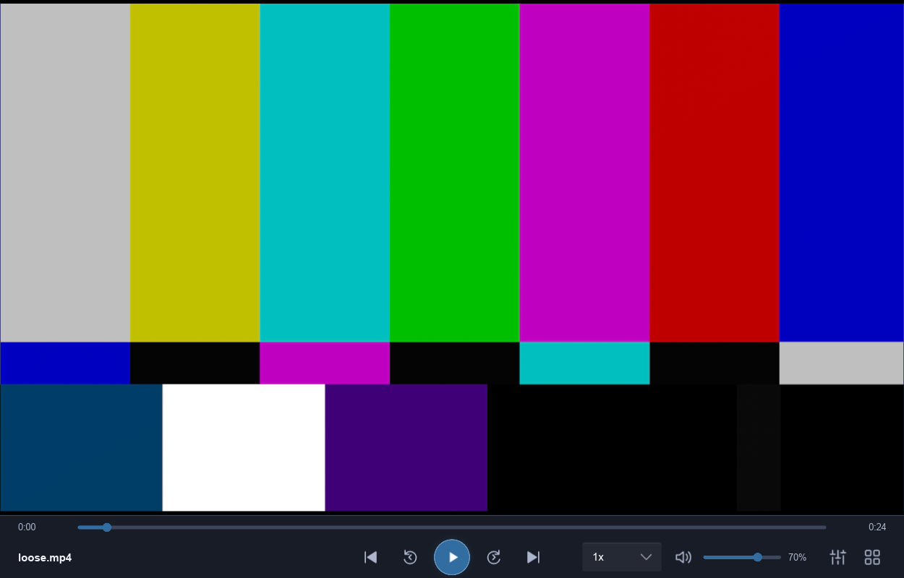

# 视频结束后重播无法暂停：修复验收

日期：2026-10-02。dev 工作区，未提交 / 合并 / 推送。

## 原因和修复

旧 Release 用自有 2 秒 H.264 无音轨视频复现：播放到末尾为 Ended，点击重播后位置恢复前进（4 秒 checkpoint 为 0.766667 秒），快照仍 Ended；下一次点击又回到开头（5 秒 checkpoint 为 0.566667 秒）。按钮以 Playing 为暂停图标条件，controller 在 Ended 每次执行 Seek(0) + Resume，所以画面在播放、UI 仍显示播放，点击反复从头开始。旧二进制 hash / 素材 hash 与最小 checkpoint 见 [旧版复现](video-pause-replay-old.md)。

worker 原先只在 Playing / Paused 分支根据 pause 更新状态，Ended 是不可退出的分支。改为单个 observed_phase：对已经加载过的 Playing / Paused / Ended 状态读取真实 idle-active / eof-reached / pause；媒体仍加载且 EOF 清除后恢复 Playing 或 Paused，EOF 仍保持 Ended。Idle / Loading / Error 和无活动媒体不被旧属性复活。确认状态仍只由 Engine 投影，没有在 UI 伪造播放、额外 reload 或重建 renderer。

idle-active / eof-reached 的含义依据 [mpv 官方属性文档](https://mpv.io/manual/stable/#property-list) 核对，在固定 runtime mpv v0.41.0-1087-ge470f8986 中通过实际运行验证。改动 worker.rs、video-library.rs 回归例子、CHANGELOG / STATUS / 接续规则；没有修改 GL、解码默认或音频策略。

## 检查与证据

fmt --check、严格 workspace all-targets clippy、workspace all-targets tests 通过，28 个独立单测（例子重复包含的测试不另计）。新增单测覆盖 EOF 清除后播放 / 暂停恢复、真正 EOF 优先、停止 / 加载 / 错误和无媒体边界。Debug yyplayer / video-library 构建通过。

Test-VideoLibrary.ps1 -SkipBuild：21 阶段通过，新增 10 个暂停 / 重播子步骤实际点击生产 Slint 按钮。一次代表结果如下（generation 全程 15，renderer initializations 全程 13）：

| 动作 | 确认状态 | 位置（秒） | UI playing |
|---|---|---:|---|
| 普通播放 | Playing | 0.666667 | true |
| 点击暂停 / 再等 0.9 秒 | Paused / Paused | 0.666667 / 0.666667 | false |
| 点击继续 | Playing | 1.566667 | true |
| seek 到末尾 | Ended | 23.966667 | false |
| 点击重播 | Playing | 0.933333 | true |
| 再点击暂停 / 再等 0.9 秒 | Paused / Paused | 0.933333 / 0.933333 | false |
| 再点击继续 | Playing | 1.833333 | true |

按钮动作没有更改 generation / renderer 创建计数，暂停位置误差断言 <0.05 秒，继续位置必须递增，证明没有重新从头 load。原库导航 / 返回续播、10 次释放重建、快速取消、损坏媒体后恢复音频、持久化 / 最小布局一并通过。最小记录见 [新版按钮回归](video-pause-replay-new.md)。Test-Video.ps1 -SkipBuild 11 动作通过：含 AAC 音轨自有 24 秒 H.264、NVDEC、普通暂停、暂停后软件解码重载保留位置、倍速 / 全屏 / 正常退出。

全部运行使用独立配置和自有媒体。用户提到的 HEVC 文件只用 ffprobe 读取流类型 / 时长来排查（HEVC + AAC + data，约 30.8 秒），没有用它生成截图或复制媒体。没有修改用户 APPDATA。

Release 构建通过；与旧二进制相同 2 秒短视频 / 6 秒脚本复验通过：3.024869 秒 Ended，4.050282 秒 Playing / 位置 0.833333，5.013600 秒 Paused / 位置 1.566667。5.5 秒脚本继续执行一次 seek，因此最终位置改变为末帧但仍暂停，不用于位置冻结断言；位置冻结由上面的真实按钮场景验证。引擎 / 渲染错误为空、renderer 创建 1 次。新 exe SHA256 为 fc30ad9bcc9ee822afc3b56f72d6338e77df57e4bfab0fefe360b0a5f032fbe2，最小诊断见 [Release 复验](video-pause-replay-release.md)。

保存必要证据后按此前用户要求清理本轮编译缓存。Clean-Workspace -WhatIf 预览检查工作区绝对目标和链接，再清理 12,408,954,418 字节（11.56 GiB）；target 仅保留 22,159,360 字节 yyplayer.exe，固定 libmpv DLL / 头文件保留，没有操作用户 APPDATA / 媒体或终止用户播放器。[预览目标](video-pause-cleanup-preview.md)、[清理输出](video-pause-cleanup-output.md) 已存档。清理后独立配置 4 秒启动 / 正常退出通过，Idle、render 帧 / 创建 0、错误为空，exe hash 不变，DLL hash 符合 manifest；见 [清理后诊断](video-pause-cleanup-smoke.md)。下一次 cargo build 会完整重编译。

## 限制与接续

实际按钮输入为 Slint 事件，未替代物理键鼠 / 文件对话框 / 多屏资格；未改 GL 状态、渲染器或时钟，未重跑 4K 图片 / HDR / USB 位准确专项。下一步在用户实际视频使用中确认体验，并继续原有生命周期 / 大库 / 多设备资格。后续播放回归需包含普通暂停、EOF 重播再暂停 / 继续，以及暂停位置和 generation 检查，不能只测试首次播放。

