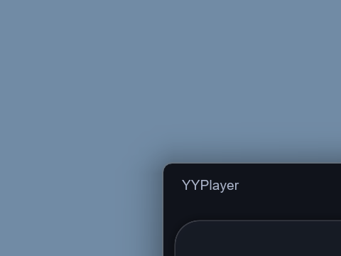
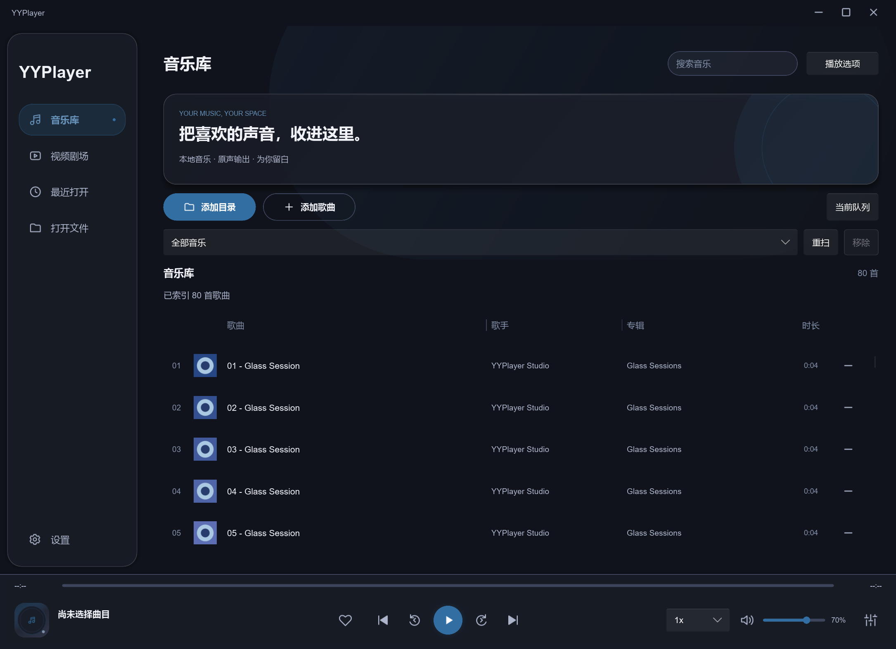
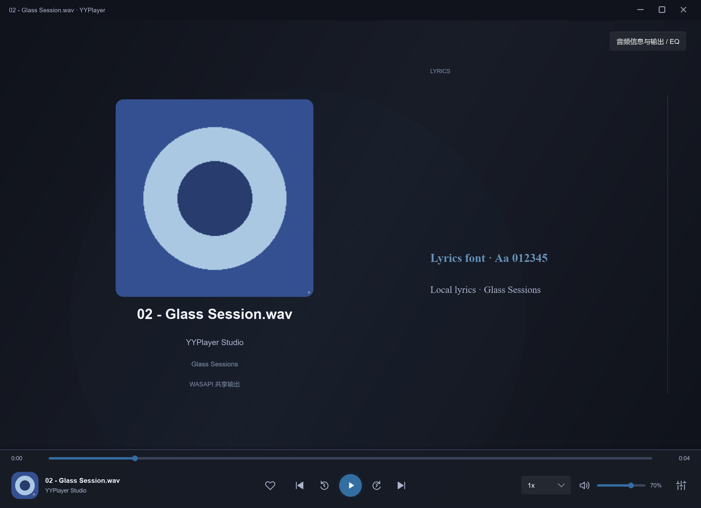

# 窗口、音乐库封面与歌词页优化验收

日期：2026-10-01 至 2026-10-02。Windows 本机开发预览，继续在 dev。Slint / slint-build 1.17.1、Winit 0.30.13、固定 mpv v0.41.0-1087-ge470f8986。仅自有音视频 / 图片 / LRC 与独立配置，不读用户歌曲、不改 APPDATA。测试素材和临时配置在 target，清理后可重新生成。

## 检查与结果

```powershell
cargo check --locked --offline --workspace --all-targets --config profile.dev.debug=0 --config profile.dev.incremental=false
cargo fmt --all -- --check
cargo clippy --locked --offline --workspace --all-targets --config profile.dev.debug=0 --config profile.dev.incremental=false -- -D warnings
cargo test --locked --offline --workspace --all-targets --config profile.dev.debug=0 --config profile.dev.incremental=false
powershell -ExecutionPolicy Bypass -File scripts/Test-UiCustomization.ps1
cargo run --locked --offline -p yyplayer-app --example ui-feedback --config profile.dev.debug=0 --config profile.dev.incremental=false
cargo run --locked --offline -p yyplayer-app --example navigation-ui --config profile.dev.debug=0 --config profile.dev.incremental=false
cargo build --locked --offline --release
powershell -ExecutionPolicy Bypass -File scripts/Test-WindowSurface.ps1
cargo build --locked --offline -p yyplayer-app --config profile.dev.debug=0 --config profile.dev.incremental=false
pwsh -File scripts/Test-Video.ps1 -SkipBuild
```

- fmt、严格 clippy、all-targets 测试、Release 构建通过。20 个独立单测（例子复用 tests 不重复计数）。新增 3 个测试：历史 / 同值不通知，实际设置成功通知、坏值失败保留旧配置；缩略图比例 / 64px / 损坏 / 大输入 / 同名回退；270 个无图项缓存只留 256、在途最多 8、缺失项不重读、过期 generation 不进缓存。
- Test-UiCustomization 从 20 扩为 **22 阶段 PASS**：80 首目录音乐（内嵌 FLAC 和同名 PNG、无封面 WAV），可见行封面最长边不超过 64、窗口化 DWM result=0 / preference=2、最大化 preference=1、还原=2。原字体 / 列拖动 / 保存、278 字体族、SRT / ASS、原生窗口控制、80→79 移除继续通过。
- 实际歌曲播放后无浮窗；歌曲切换清除旧提示，历史保持保存。真实 Slint 点击左下封面 4→0→4、大封面 4→0 均通过，歌词字体继续生效。已查看下方真实 GPU 图，无被删除的三按钮。
- ui-feedback **17 点 PASS**：提示超时 / 手动关闭、全屏 / 顶部自动隐藏、控件操作 / 三尺寸居中。navigation-ui **10 点 PASS**：真实导航、空库引导、侧栏、留白 / 三尺寸 / 简洁主题与减少动态效果。
- Release 原生窗口测试通过：no-frame、DWM 请求成功并回读 2；已查看 Windows 桌面合成的左上圆角 / 外部阴影裁片。使用纯色自有窗口背景，未捕获用户媒体 / 桌面内容。软件 / Slint snapshot 不含 OS 外观，不能代替该裁片。测试脚本只提供角部外观证据，不代表完整多屏 DPI 资格。
- 最终 Debug 视频回归：**11 动作、265 次 render**、NVDEC 起始、软件重载、暂停位置保持、最大化 / 全屏 / 正常退出全部 PASS。窗口最大化回读 preference=1、result=0，音频默认 / GL 边界保持。自有视频 SHA256 `05aeee9d532c8b1f68150f1c9782cbab64ca44bb8f96c76d31fbc4e83a99bc59`。
- 首轮 DWM 属性类型、测试布局警告 / test-module 位置已修正。原生测试纠正 PowerShell 5 UTF-8 读取和高 DPI 截图口径，保留角部证据；Release 运行 Test-Video 的场景断言通过但没有 Debug 专属截图，整套脚本改用最终 Debug 后通过，不把该首次脚本失败计为 PASS。

## 图片

原生圆角 / 阴影的角部裁片（不作为完整窗口 / 跨屏证据）：



可见行加载后的真实音乐库（第一首 FLAC 内嵌图，其余同名 PNG）：



精简后的歌词页（自有封面 / LRC）：



## 成品与限制

Release `target/release/yyplayer.exe`：21,758,976 字节，SHA256 `1bb1e740e13b306c47bb76ff3137ed6629e842ca2321995e72d3f3faedc3c152`。固定 DLL SHA256 保持 `0d5b9dbecb73e179ef39dc94314ff8905fab926a80f8d60a2367d824b7254e2e`。

原生圆角最终服从系统；Windows 10、贴靠 / 远程 / VM、多屏 DPI / 物理拖动和 macOS / Linux 未补验。字体完整字符集、大库 / 网络盘 / 长时缓存性能、损坏嵌入图格式矩阵仍待验。未重复 USB 位准确 / 拔插、4K 像素 / HDR 专项。

Git 与忽略规则检查见 [发布准备](../PUBLISHING.md)。没有选择许可证、创建远端或执行推送；用户附件 / 音乐不入仓库。

清理：预览核对后限定工作区、拒绝链接，移除 5,433,771,005 字节构建 / 测试缓存；自有视频和临时配置另清理。提交前目录约 151 MiB（含 Git / 源码 / 文档 / exe / DLL），target 仅剩 Release exe。清理后三秒独立配置空库启动、DWM result=0 / preference=2、固定 runtime、无错误与正常退出通过。编译和测试临时素材可用脚本重新生成。
